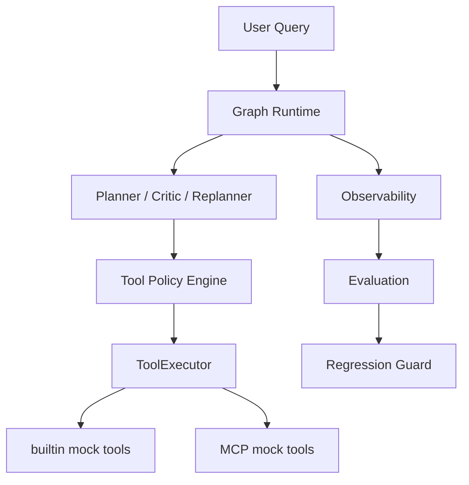

# 🌐 TripGraph Agent Runtime

[中文说明](README.zh-CN.md)

A graph-native Agent Infra prototype for LLM orchestration, MCP tools, policy routing, observability, and evaluation.

**This is not a travel app.** Travel planning is used as a concrete validation scenario. The project focuses on **Agent Runtime / Tool Infrastructure** — building a controllable, observable, and evaluable agent execution stack.

---

## 📚 Table of Contents

- [Project Background](#project-background)
- [What This Project Builds](#what-this-project-builds)
- [System Overview](#system-overview)
- [Key Capabilities](#key-capabilities)
  - [Graph-native Agent Runtime](#graph-native-agent-runtime)
  - [Plan-driven Workflow](#plan-driven-workflow)
  - [Real LLM Integration](#real-llm-integration)
  - [MCP Tool Integration](#mcp-tool-integration)
  - [Tool Routing Policy & Fallback](#tool-routing-policy--fallback)
  - [Evaluation & Regression Guard](#evaluation--regression-guard)
- [Quick Start](#quick-start)
- [Demo and Evaluation Commands](#demo-and-evaluation-commands)
- [Validation Snapshot](#validation-snapshot)

---

<a id="project-background"></a>
## 🛠️ Project Background

Modern agent systems are hard to ship because:

- LLM outputs are unstable and hard to constrain.
- Multi-step plans need controlled, resumable execution.
- Tool calls can fail and require fallback or replan.
- Agent behavior must be observable, replayable, and measurable.

TripGraph addresses the **infrastructure layer**: how to run plans as graphs, route tools, recover from failures, and prove behavior with offline evaluation — not how to build a consumer travel product.

---

<a id="what-this-project-builds"></a>
## 🏗️ What This Project Builds

- **Graph-native runtime** for plan → execute → critique → replan loops.
- **Real LLM integration** through a Qwen-compatible API (optional; default demo uses RuleBased).
- **MCP tool protocol integration** with built-in/MCP provider routing.
- **Tool routing policy** between built-in and MCP providers, with fallback and tracing.
- **Observability & persistence** — metrics, execution profiles, SQLite replay (feature-flagged).
- **Graph-level demo eval** and **tool routing regression guard** for infrastructure behavior validation.

---

<a id="system-overview"></a>
## 📊 System Overview



---

<a id="key-capabilities"></a>
## 🔑 Key Capabilities

### Graph-native Agent Runtime

Macro workflow orchestrates planning, execution, critique, and replan. Plan steps compile into an execution subgraph with conditional edges for recovery.

### Plan-driven Workflow

Structured plans with tool hints, validation, and step-level execution traces. Final synthesis aggregates tool outputs into a structured response.

### Real LLM Integration

Qwen-compatible HTTP client for planner, critic, replanner, and summarizer roles. Default demo and CI use deterministic RuleBased LLM — no API key required.

### MCP Tool Integration

Local MCP server registers `mcp_weather`, `mcp_map`, `mcp_budget` alongside built-in mock tools. The policy engine selects the provider per strategy and query context.

### Tool Routing Policy & Fallback

Strategies include:
- `planner_hint_first`
- `builtin_first`
- `mcp_first`
- `reliability_aware`

MCP execution failures can fall back to built-in equivalents with trace logging.

### Evaluation & Regression Guard

Offline tool routing evaluation with saved baseline comparison. Graph-level demo evaluation validates the full runtime path end-to-end under deterministic settings.

---

<a id="quick-start"></a>
## 🚀 Quick Start

```bash
pip install -r requirements.txt
python scripts/eval_graph_demo.py --max-cases 3
```

Default demo uses **RuleBased LLM** and **mock/local tools** — no API key, no external services.

**MCP optional:**

```bash
pip install -r requirements-mcp.txt
python scripts/smoke_mcp_tools.py
```

**Qwen optional (manual smoke only):**

```bash
export QWEN_API_KEY=...
export LLM_PROVIDER=qwen
export EVAL_MODE=auto
python scripts/smoke_qwen_llm.py
```

**Run the API locally:**

```bash
cp .env.example .env
pip install -r requirements.txt
make dev
curl http://localhost:8000/api/v1/ready
```

---

<a id="demo-and-evaluation-commands"></a>
## 📋 Demo and Evaluation Commands

| Command | Requires | What it validates |
|---|---|---|
| `python scripts/eval_graph_demo.py --max-cases 3` | none | Quick deterministic graph demo |
| `python scripts/eval_graph_demo.py` | none | Full graph-level demo eval |
| `python scripts/eval_tool_routing.py --compare-baseline` | none | Tool routing regression guard |
| `python scripts/smoke_mcp_tools.py` | MCP extra | MCP tool registration and execution path |
| `python scripts/smoke_qwen_llm.py` | `QWEN_API_KEY` | Real Qwen LLM path (manual) |
| `python scripts/smoke_qwen_mcp_tools.py` | `QWEN_API_KEY` + MCP | Qwen + MCP + policy smoke (manual) |

---

<a id="validation-snapshot"></a>
## 📊 Validation Snapshot

Latest deterministic validation snapshot (RuleBased LLM + mock/local tools, no external API):

**Graph Demo Eval**

- execution_success_rate: **1.0**
- tool_family_recall: **1.0**
- tool_selection_recall: **1.0**
- provider_recall: **1.0**
- final_section_coverage: **1.0**

**Tool Routing Eval**

- tool_selection_accuracy: **90.9%**
- provider_accuracy: **91.7%**
- regression_detected: **false**

These metrics validate **infrastructure behavior** rather than real travel quality. They come from local deterministic evaluation with RuleBased planner and mock weather/map/budget tools — not from live travel APIs or production LLM runs.

---

<a id="real-vs-mock-boundaries"></a>
## 🛠️ Real vs Mock Boundaries

**Implemented / real infrastructure**

- Graph runtime and plan-driven workflow
- Qwen-compatible LLM integration (when configured)
- MCP protocol integration (local mock MCP server)
- Tool routing policy, fallback, and tracing
- Evaluation datasets and regression guard

**Mock / local validation**

- `weather` / `map` / `budget` builtin tools are stable mock implementations
- `mcp_weather` / `mcp_map` / `mcp_budget` are local mock MCP tools
- No real weather, map, or budget API is required by default
- Qwen + MCP smoke is **optional and manual**, not the default CI path

---

<a id="repository-structure"></a>
## 📁 Repository Structure

```
app/              FastAPI entrypoint and bootstrap
graph/            Graph runtime, workflow nodes, and execution runner
agents/           Planner and agent-facing logic
plan/             Orchestrator, executor, critic, replanner
tools/            Registry, router, policy, MCP adapters
observability/    Metrics, profiles, structured logging
persistence/      SQLite execution recorder and replay
eval/             Tool routing eval, graph demo eval, datasets
scripts/          Demo and smoke scripts
docs/             Engineering notes (not linked from this page)
```

---

<a id="roadmap"></a>
## 🛣️ Roadmap

- [x] Graph Runtime
- [x] Qwen LLM integration
- [x] MCP integration
- [x] Tool Policy & fallback
- [x] Tool Routing Eval
- [x] Regression Guard
- [x] Graph Demo Eval
- [ ] Real weather MCP smoke
- [ ] Graph-level eval regression guard
- [ ] Auto-updated reliability stats
- [ ] Real map / search MCP providers

---

Detailed engineering notes are kept under `docs/` for traceability.

## License

See repository for license information.
