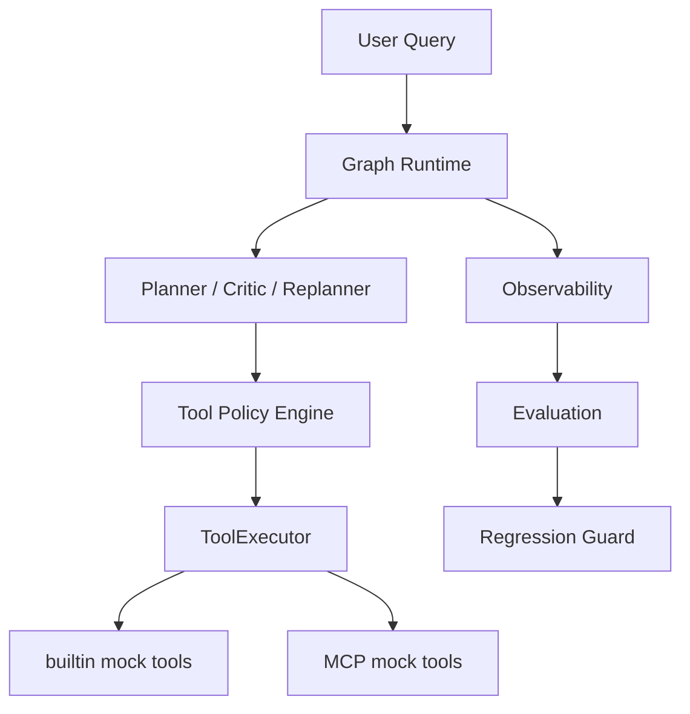

# 🌐 TripGraph Agent Runtime

[English](README.md)

面向 LLM 编排、MCP 工具、策略路由、可观测性与评估的 **Graph-native Agent 基础设施** 原型。

**这不是旅行规划 App。** 旅行场景仅用于验证 Agent 链路是否跑通。项目关注的是 **Agent Runtime / 工具基础设施** —— 如何可控地执行多步计划、路由工具、处理失败，并对行为做离线评估。

---

## 📚 目录

- [项目背景](#项目背景)
- [项目构建内容](#项目构建内容)
- [系统总览](#系统总览)
- [核心能力](#核心能力)
  - [Graph-native Agent Runtime](#graph-native-agent-runtime)
  - [计划驱动工作流](#计划驱动工作流)
  - [真实 LLM 接入](#真实-llm-接入)
  - [MCP 工具集成](#mcp-工具集成)
  - [工具路由策略与 Fallback](#工具路由策略与-fallback)
  - [评估与回归门禁](#评估与回归门禁)
- [快速开始](#快速开始)
- [Demo 与评估命令](#demo-与评估命令)
- [验证结果快照](#验证结果快照)
- [真实能力与 Mock 边界](#真实能力与-mock-边界)
- [仓库结构](#仓库结构)
- [Roadmap](#roadmap)
- [License](#license)

---

## 📖 项目背景

现代 Agent 系统难落地，常见原因包括：

- LLM 输出不稳定，难以约束为可执行步骤
- 多步计划需要可控、可恢复的执行引擎
- 工具调用可能失败，需要 fallback 或 replan
- Agent 行为必须可观测、可回放、可度量

TripGraph 解决的是 **基础设施层**：计划如何编译为图、工具如何路由、失败如何恢复、行为如何用离线评估证明 —— 而不是如何做一款面向 C 端的旅行产品。

---

## 🛠️ 项目构建内容

- **Graph-native 运行时**：plan → execute → critique → replan 闭环
- **真实 LLM 接入**：Qwen 兼容 API（可选；默认 demo 使用 RuleBased，无需 API Key）
- **MCP 工具协议**：builtin 与 MCP 双 provider 注册与路由
- **工具路由策略**：多策略选择、fallback、trace 记录
- **可观测与持久化**：指标、执行 profile、SQLite 回放（Feature flag 控制）
- **Graph 级 demo 评估** 与 **工具路由回归门禁**：验证 infra 行为而非旅行质量

---

## 🌍 系统总览



---

## 🔑 核心能力

### Graph-native Agent Runtime

宏观工作流编排规划、执行、质检与重规划。Plan 步骤编译为执行子图，支持条件边驱动的恢复路径。

### 计划驱动工作流

结构化 Plan、tool hint、校验与逐步 execution trace；`final_synthesis` 将工具输出汇总为结构化答复。

### 真实 LLM 接入

Qwen 兼容 HTTP 客户端，覆盖 planner / critic / replanner / summarizer 等角色。默认 demo 与 CI 使用确定性 RuleBased LLM，**不需要 API Key**。

### MCP 工具集成

本地 MCP Server 注册 `mcp_weather`、`mcp_map`、`mcp_budget`，与 builtin mock 工具并存；策略引擎按 query 与配置选择 provider。

### 工具路由策略与 Fallback

支持 `planner_hint_first`、`builtin_first`、`mcp_first`、`reliability_aware` 等策略；MCP 执行失败时可回退到 builtin 并写入 trace。

### 评估与回归门禁

离线 tool routing 评估 + baseline 对比；Graph demo eval 在确定性设置下验证完整运行时链路。

---

## 🚀 快速开始

```bash
pip install -r requirements.txt
python scripts/eval_graph_demo.py --max-cases 3
```

默认 demo 使用 **RuleBased LLM** 与 **mock/local 工具**，无需 API Key，也不依赖外部服务。

**可选：MCP**

```bash
pip install -r requirements-mcp.txt
python scripts/smoke_mcp_tools.py
```

**可选：Qwen（仅 manual smoke）**

```bash
export QWEN_API_KEY=...
export LLM_PROVIDER=qwen
export EVAL_MODE=auto
python scripts/smoke_qwen_llm.py
```

**本地启动 API：**

```bash
cp .env.example .env
pip install -r requirements.txt
make dev
curl http://localhost:8000/api/v1/ready
```

---

## 📋 Demo 与评估命令

| 命令 | 依赖 | 验证内容 |
|---|---|---|
| `python scripts/eval_graph_demo.py --max-cases 3` | 无 | 快速确定性 Graph demo |
| `python scripts/eval_graph_demo.py` | 无 | 完整 Graph 级 demo 评估 |
| `python scripts/eval_tool_routing.py --compare-baseline` | 无 | 工具路由回归门禁 |
| `python scripts/smoke_mcp_tools.py` | MCP 额外依赖 | MCP 工具注册与执行路径 |
| `python scripts/smoke_qwen_llm.py` | `QWEN_API_KEY` | 真实 Qwen LLM 路径（manual） |
| `python scripts/smoke_qwen_mcp_tools.py` | `QWEN_API_KEY` + MCP | Qwen + MCP + Policy smoke（manual） |

---

## 📊 验证结果快照

以下为最新 **确定性本地评估** 快照（RuleBased LLM + mock/local 工具，无外部 API）：

**Graph Demo Eval**

- execution_success_rate: **1.0**
- tool_family_recall: **1.0**
- tool_selection_recall: **1.0**
- provider_recall: **1.0**
- final_section_coverage:** **1.0**

 **Tool Routing Eval**
- tool_selection_accuracy:** **90.9%**
- provider_accuracy:** **91.7%**
- regression_detected:** **false**

这些指标验证的是 **基础设施行为**，不是真实旅行规划质量。数据来自本地 RuleBased + mock weather/map/budget 的确定性评估，而非线上旅行 API 或生产 LLM 流量。

---

## 🛠️ 真实能力与 Mock 边界

**已实现 / 真实基础设施**
- Graph 运行时与计划驱动工作流
- Qwen 兼容 LLM 接入（配置后启用）
- MCP 协议集成（本地 mock MCP Server）
- 工具路由策略、fallback 与 tracing
- 评估数据集与回归门禁

**Mock / 本地验证**
- `weather` / `map` / `budget` builtin 工具为稳定 mock 实现
- `mcp_weather` / `mcp_map` / `mcp_budget` 为本地 mock MCP 工具
- 默认路径 **不需要** 真实天气、地图或预算 API
- Qwen + MCP smoke 为 **可选 manual 路径**，非默认 CI

---

## 📁 仓库结构

```plaintext
app/              FastAPI 入口与 bootstrap
graph/            Graph 运行时、工作流节点与执行 runner
agents/           Planner 与 Agent 侧逻辑
plan/             编排、执行、质检、重规划
tools/            Registry、路由、策略、MCP 适配
observability/    指标、profile、结构化日志
persistence/      SQLite 执行录制与回放
eval/             工具路由评估、Graph demo 评估、数据集
scripts/          Demo 与 smoke 脚本
docs/             工程笔记（本页不链接具体文档）
```

---

## 🛣️ Roadmap

- [x] Graph Runtime
- [x] Qwen LLM 接入
- [x] MCP 集成
- [x] Tool Policy 与 fallback
- [x] Tool Routing Eval
- [x] Regression Guard
- [x] Graph Demo Eval
- [ ] 真实 weather MCP smoke
- [ ] Graph-level eval regression guard
- [ ] 自动更新 reliability stats
- [ ] 真实 map / search MCP provider

---

详细工程笔记保存在 `docs/` 目录，供追溯使用。

## License

See repository for license information.