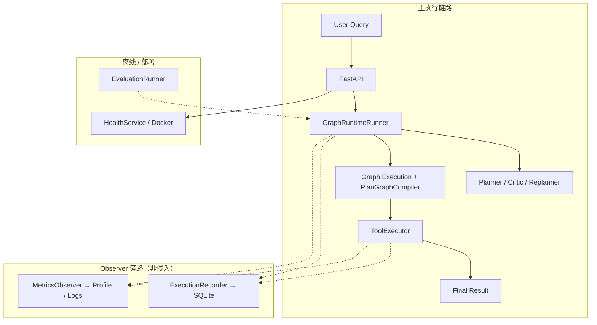
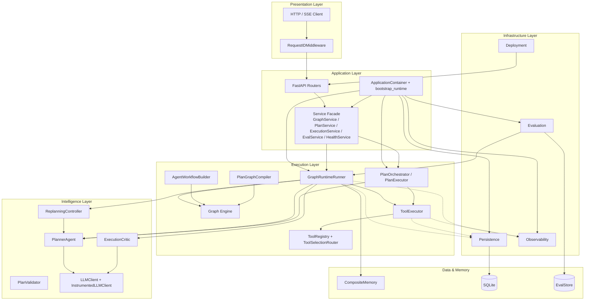

# TripPlan Multi-Agent — System Architecture

> 解决什么问题：让 Agent 的「规划 → 执行 → 质检 → 返工」可编排、可回溯、可上线。  
> v0.8.0 · 150 tests passed

---

## 1. 一句话定位

以自研 **Graph Runtime** 为核心的 Multi-Agent 基础设施：Plan 表达意图，Graph 驱动执行，Observer 旁路负责持久化与可观测，Evaluation 与 Deployment 独立于在线热路径。

---

## 2. Architecture at a Glance

先看清 **主链路** 和 **旁路**，再往下看分层大图。



**读图方式：**

- 实线 = 一次 query 必须经过的路径
- 虚线 = 订阅事件、异步写入，关掉 Feature flag 后主链不变
- Evaluation 批量调用同一 `GraphRuntimeRunner`，不进用户请求热路径

---

## 3. Full Layered Architecture

需要对接代码目录或面试深入时，用这张分层图。



---

## 4. 三层解释

### Intelligence Layer — 决定做什么、检查做得好不好

**问题：** 用户一句话太模糊，系统需要先「拆任务」，执行完还要「验货」。

| 角色 | 做什么 |
|------|--------|
| **PlannerAgent** | LLM 生成 JSON Plan（goal + steps + tool_hint） |
| **PlanValidator** | 校验 Plan 合法（tool 存在、依赖合理） |
| **ExecutionCritic** | 执行后打分，输出 `need_replan` |
| **ReplanningController** | 根据 Critic 反馈改写 Plan |

这一层 **不直接调 Tool**，只产出意图与质量信号。  
代码：`agents/planner.py`、`plan/execution_critic.py`、`plan/replanning_controller.py`

### Execution Layer — 决定怎么跑、怎么调用工具

**问题：** Plan 是静态描述，需要变成可执行的流程，并逐步调用外部能力。

| 角色 | 做什么 |
|------|--------|
| **GraphRuntimeRunner** | 主入口：`invoke()` / `stream()` |
| **Graph + AgentWorkflowBuilder** | Macro 工作流：memory → plan → execute → critic → replan |
| **PlanGraphCompiler** | Plan steps → 子图（step_1 / plan_join_N） |
| **PlanExecutor + ToolExecutor** | 逐步执行，ReliabilityPolicy 保障重试与超时 |
| **ToolRegistry + Router** | 注册发现与路由选择 |

两条路径：

- **Graph-native**（主）：`/graph/execute` → 完整 Macro + 子图
- **Plan-only**（兼容）：`/plan/execute` → `PlanOrchestrator` 线性循环

代码：`graph/runtime/`、`tools/`、`plan/executor.py`

### Infra Layer — 记录、监控、评估、部署

**问题：** 生产环境需要「事后能查、能测、能发布」，但不能拖慢 Runtime。

| 子系统 | 做什么 |
|--------|--------|
| **Persistence** | Observer 写 SQLite；replay / session restore |
| **Observability** | Metrics Profile、JSON log、trace_id / execution_id |
| **Evaluation** | JSONL 批量跑分、RegressionGuard |
| **Deployment** | Docker、DI 容器、Service Layer、`/health/detailed` |

全部通过 **Observer / Decorator / Feature flag** 接入；关闭后主链行为不变。  
代码：`persistence/`、`observability/`、`eval/`、`app/container.py`

---

## 5. 关键设计原则

### Graph 是主 Runtime，Plan 是语义层

Plan 让人和 LLM 对齐「要做什么」；Graph 让机器对齐「怎么跑、何时分支、何时循环」。`PlanGraphCompiler` 把两者接到同一引擎上。

### Observer 非侵入

```
GraphRuntimeRunner._on_graph_event() → Recorder + MetricsObserver
ToolExecutor → ToolTracer → recorder + observer（链式回调）
InstrumentedLLMClient 包装 LLM → token / cost 指标
```

`Graph.astream()` 不 import persistence 或 observability 模块。

### Feature flags 驱动装配

`bootstrap_runtime()`（`app/bootstrap.py`）按 `PERSISTENCE_ENABLED`、`METRICS_ENABLED`、`EVAL_ENABLED` 等条件装配子系统。

### Service Layer 与 Runtime 解耦

API → `GraphService` 等 Facade → `GraphRuntimeRunner`；Legacy 路由保留在 `app/api/v1/legacy.py`。

---

## 6. Macro Graph 节点

`graph/runtime/workflow.py`：

```
memory_load → planner → compile_plan → router → execution → memory_persist
    → critic
        ├─ need_replan → replanner → router（循环）
        └─ done → finalize → memory_persist → END
```

---

## 7. 相关文档

- [Runtime Flow 叙事](../system_engineering/07_runtime_flow_narrative.md)
- [README](../../README.md)
- [简历项目描述](../resume/resume_project_description.md)
- [Phase 5–8 生产报告](../system_engineering/06_phase5_8_production_report.md)
