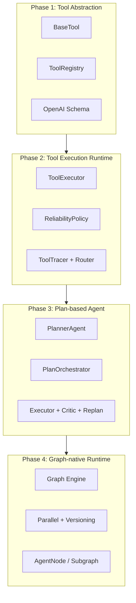

# TripPlan Multi-Agent — Project Overview

## 1. 项目定位

TripPlan Multi-Agent 是一个**分阶段演进的多 Agent 旅行规划系统**。核心设计思路不是一次性堆功能，而是按运行时抽象层级逐层建设：

```
Tool 抽象 → Tool 执行运行时 → Plan Agent → Graph-native Runtime
```

每一阶段都在上一阶段的接口边界上叠加能力，旧路径保留为 fallback，新路径成为 primary runtime。

---

## 2. 技术栈

| 层级 | 选型 |
|------|------|
| Web | FastAPI + Uvicorn |
| 数据校验 | Pydantic v2 |
| 配置 | pydantic-settings + `.env` |
| 测试 | pytest + pytest-asyncio（125 tests） |
| LLM | OpenAI API（可选）/ RuleBasedLLM（离线 fallback） |
| Graph | 自研 Graph engine（Phase 4），LangGraph 为 optional 依赖 |

---

## 3. 仓库结构（按运行时职责）

```
TripPlan-MultiAgent/
├── tools/              # Phase 1–2: Tool 抽象 + 执行运行时
├── plan/               # Phase 3: Plan 编排、执行、校验、恢复
├── agents/             # Planner / Manager / Specialist
├── graph/runtime/      # Phase 4: Graph-native agent runtime
├── memory/             # Short / Long / Episodic memory
├── schemas/            # API & domain models
├── app/                # FastAPI 入口与路由
└── tests/              # unit / integration / system
```

---

## 4. 四阶段演进总览



| Phase | 核心问题 | Primary Entry |
|-------|----------|---------------|
| 1 | 如何统一描述和注册 Tool？ | `ToolRegistry` |
| 2 | 如何可靠地执行 Tool 并观测？ | `ToolExecutor` |
| 3 | 如何用 Plan 驱动多步 Agent 行为？ | `PlanOrchestrator` / `POST /plan_execute` |
| 4 | 如何用 Graph 统一编排、并行、版本与回放？ | `GraphRuntimeRunner` / `POST /graph_execute` |

---

## 5. API 面（当前）

| Method | Path | Runtime |
|--------|------|---------|
| GET | `/api/v1/health` | — |
| POST | `/api/v1/chat` | ManagerAgent（多 specialist 路由） |
| POST | `/api/v1/plan_execute` | Phase 3 PlanOrchestrator |
| POST | `/api/v1/graph_execute` | Phase 4 GraphRuntimeRunner |
| POST | `/api/v1/graph_replay` | Graph replay debugger |
| POST | `/api/v1/graph_state/*` | State versioning（rollback / fork / diff / replay_branch） |

Phase 3 与 Phase 4 **并存**：`plan_execute` 未删除，便于对比与回退。

---

## 6. 系统成熟度（工程现状）

| 维度 | 状态 | 说明 |
|------|------|------|
| 持久化 | 🟡 Memory only | JSONL 长期记忆 + 进程内 session |
| 观测 | 🟡 Basic logs | std logging + request id + tool/graph trace |
| 评估 | 🟡 Basic tests | 125 pytest，无 offline benchmark |
| 部署 | 🟡 Uvicorn single process | 无 Docker / 多服务 |

详见 [05_system_evolution_summary.md](./05_system_evolution_summary.md)。

---

## 7. 文档索引

| 文件 | 内容 |
|------|------|
| [01_phase1_tool_system.md](./01_phase1_tool_system.md) | Tool 抽象层 |
| [02_phase2_tool_executor.md](./02_phase2_tool_executor.md) | Tool 执行运行时 |
| [03_phase3_planner_system.md](./03_phase3_planner_system.md) | Plan-based Agent |
| [04_phase4_graph_runtime.md](./04_phase4_graph_runtime.md) | Graph-native Runtime |
| [05_system_evolution_summary.md](./05_system_evolution_summary.md) | 演进树与面试要点 |

---

## 8. 本地运行

```bash
# 依赖
pip install -r requirements.txt

# 启动 API
uvicorn app.main:app --reload --port 8000

# 测试
pytest tests/ -q
```

配置参考 `.env.example`；无 `OPENAI_API_KEY` 时自动使用 RuleBasedLLM，可离线跑通全流程。
