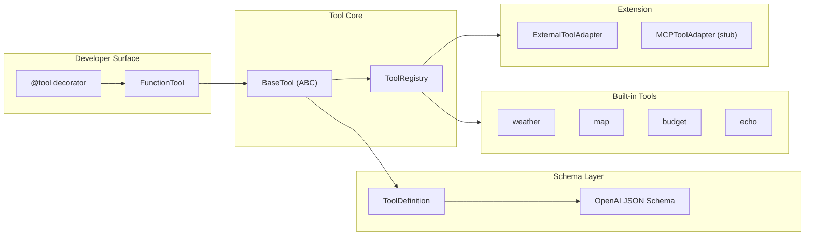

# Phase 1 — Tool Abstraction Layer

## Objective

建立 Agent 与外部能力之间的**统一抽象边界**，使 Tool 具备：

- 一致的调用接口（`run(args) → result`）
- 可序列化的参数 schema（OpenAI function calling 兼容）
- 可发现、可注册、可扩展的插件模型

Phase 1 **不关注**执行可靠性、路由、重试——只解决「Tool 是什么、如何描述、如何挂载」。

---

## Architecture



---

## Key Components

### `BaseTool` — `tools/base.py`

抽象基类，定义 Tool 契约：

```python
class BaseTool(ABC):
    name: str
    description: str
    input_schema: type[BaseModel]

    async def run(self, args: dict[str, Any]) -> Any: ...
    def validate_args(self, args: dict) -> BaseModel: ...
    def to_openai_schema(self) -> dict: ...
```

设计要点：参数校验委托给 Pydantic model，schema 导出与 OpenAI tools API 对齐。

### `FunctionTool` — `tools/function_tool.py`

将普通 Python 函数包装为 Tool，支持 sync/async，自动从函数签名推断 `input_schema`。

### `@tool` — `tools/decorator.py`

装饰器注册入口，创建 `FunctionTool` 实例并写入 pending registry，供 `ToolRegistry.discover()` 批量加载。

### `ToolRegistry` — `tools/registry.py`

- `register(tool)` / `get(name)` / `list_tools()`
- `ToolRegistry.default()` → `discover("tools.builtin")` 自动加载内置 Tool
- 重复注册抛错，保证 name 全局唯一

### Schema — `schemas/tool.py`

| 类型 | 用途 |
|------|------|
| `ToolDefinition` | name + description + JSON Schema parameters |
| `ToolCall` | LLM 输出的 tool call 结构 |
| `ToolObservation` | 执行结果封装 |
| `LLMOutputParser` | 解析 LLM 混合文本 + tool call JSON |

### External Adapters — `tools/adapters/`

| 类 | 状态 |
|----|------|
| `ExternalToolAdapter` | 外部 JSON schema → 动态 Pydantic → BaseTool |
| `MCPToolAdapter` | MCP 协议占位，接口已预留 |

---

## Implementation Highlights

1. **Schema-first**：Tool 的参数约束在 Pydantic model 层定义，而非运行时 ad-hoc 校验。
2. **OpenAI 互操作**：`to_openai_schema()` 使 Planner / Router 可直接注入 LLM prompt。
3. **Discover 模式**：内置 Tool 通过 package scan 注册，新增 Tool 只需在 `tools/builtin/` 加文件并 `@tool`。
4. **Adapter 扩展点**：外部 Tool 源（MCP、HTTP、RPC）统一适配为 `BaseTool`，Registry 无感知。

---

## Test Coverage

| 文件 | 覆盖点 |
|------|--------|
| `tests/unit/test_tools_registry.py` | 自动发现、重复注册、OpenAI schema 导出 |
| `tests/unit/test_schemas.py` | ToolDefinition OpenAI 格式 |

Phase 1 的边界校验在 Phase 2 `test_tool_executor.py` 中进一步覆盖。

---

## Evolution Notes

- **起点**：无 Tool 层，Agent 直接调函数。
- **Phase 1 完成**：Tool 成为一等公民，具备 registry + schema + 插件模型。
- **为 Phase 2 铺垫**：`ToolExecutor` 只需依赖 `ToolRegistry.get(name)`，不关心 Tool 来源。

---

## Limitations

| 缺失 | 说明 |
|------|------|
| 执行语义 | 无 retry / timeout / fallback（Phase 2） |
| 路由 | 无 tool selection（Phase 2 Router） |
| 权限 / 沙箱 | Tool 无 isolation 或 capability ACL |
| MCP | 仅占位，未接真实 MCP server |

---

## API / Interface

Phase 1 无独立 HTTP 端点，对外暴露为 Python API：

```python
from tools.registry import ToolRegistry

registry = ToolRegistry.default()
tool = registry.get("weather")
result = await tool.run({"city": "上海"})
schema = registry.to_openai_schemas()  # 供 LLM prompt 注入
```

内置 Tool 清单：

| Name | 文件 | 能力 |
|------|------|------|
| `weather` | `tools/builtin/weather.py` | 城市天气查询 |
| `map` | `tools/builtin/map.py` | 路线规划 |
| `budget` | `tools/builtin/budget.py` | 旅行预算估算 |
| `echo` | `tools/builtin/echo.py` | 调试 echo |
