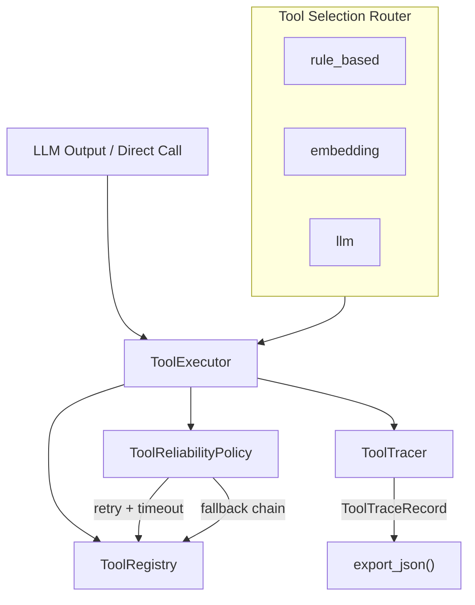

# Phase 2 — Tool Execution Runtime

## Objective

在 Phase 1 Tool 抽象之上，构建**生产级 Tool 执行运行时**：

- 统一执行入口（单 Tool / LLM output / batch）
- 可靠性策略（retry、timeout、fallback）
- 可观测性（trace 记录、latency、树形导出）
- Tool 选择路由（rule / embedding / LLM）

Phase 2 回答的问题：**Tool 被选中后，如何可靠执行并被观测？**

---

## Architecture



---

## Key Components

### `ToolExecutor` — `tools/executor.py`

唯一执行入口，职责：

| 方法 | 场景 |
|------|------|
| `execute(tool_name, args)` | 直接调用 |
| `execute_llm_call(tool_call)` | 解析 LLM tool call |
| `process_llm_output(raw)` | LLM 混合输出 → tool call 或 final text |
| `execute_batch(calls)` | 批量执行（首个失败即中断） |

集成：`ToolRegistry` + `ToolReliabilityPolicy` + `ToolTracer`。

### `ToolReliabilityPolicy` — `tools/reliability.py`

```python
@dataclass
class ToolReliabilityPolicy:
    max_retries: int = 2        # → max_attempts = 1 + max_retries
    timeout_sec: float = 30.0
    fallback_tools: dict[str, str] = {}  # primary → fallback name
```

执行循环：

1. `asyncio.wait_for(tool.run(), timeout)` — 超时 → `ToolTimeoutError`
2. 重试至 `max_attempts` 耗尽
3. 查 `fallback_tools` 映射，以新 call_id 执行 fallback Tool
4. 每次 attempt 写入 `ToolTraceRecord`（含 attempt 序号）

### `ToolTracer` — `tools/tracing.py`

| 能力 | 说明 |
|------|------|
| `ToolTraceRecord` | call_id, latency_ms, success, error, parent_id, attempt |
| Context manager timer | 自动记录每次 invoke 耗时 |
| `export_json()` | 结构化 trace 导出 |
| `print_trace_tree()` | batch 调用的树形 debug 输出 |

配置：`TOOL_TRACE_DEBUG=true` 时打印 trace tree。

### `ToolSelectionRouter` — `tools/router/`

| 策略 | 实现 | 机制 |
|------|------|------|
| `rule_based` | `rule_based.py` | 关键词 → tool name 映射 |
| `embedding` | `embedding.py` | 向量相似度（轻量 fallback） |
| `llm` | `llm.py` | LLM 选 tool + alternatives |

门面类 `ToolSelectionRouter` 根据 `TOOL_ROUTER_STRATEGY` 配置切换策略，返回 `ToolSelectionResult(best_tool, confidence, alternatives)`。

---

## Implementation Highlights

1. **Policy 与 Execution 分离**：Reliability 是纯 dataclass 策略，Executor 负责 interpret，便于单测 mock。
2. **Trace 作为一等输出**：Plan / Graph runtime 均可将 `tool_trace_json` 附在 API 响应中，支持 post-mortem。
3. **LLM 输出容错**：`LLMOutputParser` 处理纯文本、纯 JSON、混合输出三种 LLM 响应形态。
4. **Fallback 链**：primary 耗尽 retries 后自动降级到 mapped fallback tool，trace 中标记 `is_fallback=true`。

---

## Test Coverage

| 文件 | 用例数 | 覆盖点 |
|------|--------|--------|
| `test_tool_executor.py` | ~10 | 正常调用、missing args、invalid JSON、LLM 混合输出 |
| `test_tool_reliability.py` | ~6 | retry 成功/耗尽、timeout、fallback 链 |
| `test_tool_tracing.py` | ~5 | trace 字段、batch 树形层级、export JSON |
| `test_tool_router.py` | ~8 | 三策略选型、alternatives、no match |

合计 **~29 个** Phase 2 相关 unit tests。

---

## Evolution Notes

| 自 Phase 1 | 变化 |
|------------|------|
| 直接 `tool.run()` | 统一走 `ToolExecutor.execute()` |
| 无错误语义 | 结构化 `ToolExecutionError` / `ToolTimeoutError` |
| 无选型 | Router 在 Plan step 缺 `tool_hint` 时自动补全 |

Phase 2 输出成为 Phase 3 `PlanExecutor._run_step_with_recovery()` 的底层依赖。

---

## Limitations

| 缺失 | 说明 |
|------|------|
| 分布式 trace | Trace 仅在进程内，无 OTLP/Jaeger |
| 熔断 / 限流 | 无 circuit breaker 或 rate limit |
| 并行 batch | `execute_batch` 串行执行 |
| Embedding router | 轻量实现，非 production embedding model |

---

## API / Interface

Phase 2 无独立 HTTP 端点，通过 Phase 3/4 间接暴露。

Python API：

```python
from tools.executor import ToolExecutor
from tools.registry import ToolRegistry
from tools.reliability import ToolReliabilityPolicy

executor = ToolExecutor(
    ToolRegistry.default(),
    reliability=ToolReliabilityPolicy(max_retries=2, timeout_sec=30),
)
obs = await executor.execute("weather", {"city": "上海"})
trace = executor.tracer.export_json()
```

配置项（`.env.example`）：

```
TOOL_MAX_RETRIES=2
TOOL_TIMEOUT_SEC=30.0
TOOL_TRACE_DEBUG=false
TOOL_ROUTER_STRATEGY=rule_based
```
