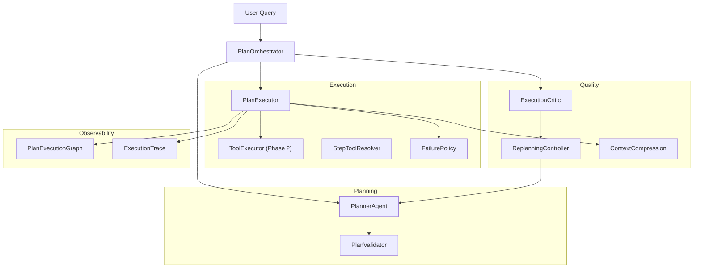

# Phase 3 — Plan-based Agent System

## Objective

在 Tool 执行运行时之上，构建**Plan 驱动的 Agent 编排系统**：

- LLM 产出结构化 Plan（goal + steps + dependencies + tool_hint）
- 按 DAG 依赖顺序执行 step，每 step 映射到一个 Tool
- 执行失败时按 policy 恢复（retry / skip / replan）
- 执行后 Critic 评估质量，驱动 Replan 闭环
- Context 超长时自动压缩

Phase 3 回答的问题：**Agent 如何完成多步任务，并在失败/质量不足时自我修正？**

---

## Architecture



**主循环**（`PlanOrchestrator.run()`）：

```
validate(plan) → execute(steps) → critic → [replan → re-execute]* → synthesize(final)
```

---

## Key Components

### `PlannerAgent` — `agents/planner.py`

| 方法 | 职责 |
|------|------|
| `create_plan(query)` | LLM 生成 JSON Plan |
| `replan_unfinished_steps(state, reason)` | 保留已完成 step，重写未完成部分 |
| `replan_from_critique(state, critique)` | Critic 驱动 replan |

Prompt 注入：`planner_prompt.py` 将 `ToolRegistry` 中 tool name + description 写入 system prompt，约束 LLM 输出合法 `tool_hint`。

JSON 解析失败时带 available tools 列表重试（`PLANNER_MAX_RETRIES`）。

### `PlanValidator` — `plan/validator.py`

静态校验，不执行：

- goal 非空、steps 非空
- step id 连续、无重复
- dependency 存在、无环
- `tool_hint` 必须在 ToolRegistry 中

输出 `PlanValidationReport`，API 层 422 返回。

### `PlanExecutor` — `plan/executor.py`

运行时执行引擎：

1. 拓扑排序选 next executable step
2. `StepToolResolver` 将 step.task + tool_hint → tool args
3. `ToolExecutor.execute()` 调用 Tool
4. 失败时 `FailurePolicy` 介入：

| Policy | 行为 |
|--------|------|
| `retry` | 重置 step 状态，重试（上限 `PLAN_STEP_MAX_RETRIES`） |
| `skip` | 标记 SKIPPED，继续后续 step |
| `replan` | 调 Planner 重写未完成 steps |

5. 成功后 `_maybe_compress_context()` 压缩 `global_context`

### `PlanState` — `plan/state.py`

可变运行时状态：

- `step_results` / `_step_status` / `completed_steps`
- `global_context`（跨 step 共享）
- `execution_trace`（逐步审计日志）
- `apply_replanned_steps()` — replan 时保留已完成 step，remap 新 step id

### `ExecutionCritic` — `plan/execution_critic.py`

执行完成后评估：

- 输出 `ExecutionCritique(score, need_replan, goal_completed, missing_info)`
- RuleBasedLLM 模式下基于 heuristics（如是否含 budget 步骤）
- 配置：`PLAN_EXECUTION_CRITIC_ENABLED`

### `ReplanningController` — `plan/replanning_controller.py`

Critic 驱动 replan：

- 保留已完成 step（task 不可变）
- 替换未完成 step
- 上限 `PLAN_CRITIC_MAX_REPLAN_ATTEMPTS`

### `PlanExecutionGraph` — `plan/graph.py`

Plan DAG 可视化：

- 节点状态：PENDING / RUNNING / COMPLETED / FAILED / SKIPPED
- `export_graph_json()` / `to_mermaid()` 导出

### `PlanOrchestrator` — `plan/orchestrator.py`

Phase 3 **Primary Entry**，组装上述组件：

```python
class PlanOrchestrator:
    async def run(self, query, session_id) -> PlanExecuteResponse:
        plan = await self._planner.create_plan(query)
        self._validator.assert_valid(plan)
        state = PlanState.from_plan(plan, session_id=session_id)
        # execute → critic → replan loop
        return PlanExecuteResponse(plan=..., execution_trace=..., final_result=...)
```

预留 `PlanGraphHook` Protocol 供 Phase 4 LangGraph 集成（已部分实现）。

---

## Implementation Highlights

1. **Plan 作为中间表示（IR）**：LLM 不直接调 Tool，而是产出 declarative Plan；Executor 负责 imperative 执行。解耦 planning 与 execution。
2. **已完成 step 不可变**：Replan 只替换未完成部分，避免重复调用 weather 等副作用 Tool。
3. **Failure 三级策略**：retry → skip → replan 形成递进恢复链，可通过 `PLAN_FAILURE_POLICY` 配置默认行为。
4. **Context compression**：`global_context` 超 `PLAN_CONTEXT_MAX_CHARS` 时 LLM/rule 压缩，防止长 plan 上下文爆炸。
5. **Execution trace 审计**：每 step 记录 tool_name、success、attempt、recovery_action，支持 post-mortem。

---

## Test Coverage

| 文件 | 覆盖点 |
|------|--------|
| `test_plan_validator.py` | 12 cases：环、重复 id、unknown tool |
| `test_plan_failure_recovery.py` | retry / skip / replan 三策略 |
| `test_plan_execution_graph.py` | DAG 构建、状态同步、JSON 导出 |
| `test_execution_critic.py` | payload 评估、orchestrator 集成 |
| `test_replanning_controller.py` | 保留 completed、max attempts |
| `test_context_compression.py` | 阈值触发、summary 替换 |
| `test_planner_prompt.py` | tool registry 注入、复杂 query 分解 |
| `test_plan_execute.py` (integration) | 端到端 plan_execute API |
| `test_plan_validation.py` (integration) | 422 校验失败 |

合计 **~40+** Phase 3 相关 tests。

---

## Evolution Notes

| 自 Phase 2 | 变化 |
|------------|------|
| 单 Tool 调用 | 多 step DAG 编排 |
| 无任务结构 | Plan 作为 LLM ↔ Runtime 的 IR |
| 无质量闭环 | Critic + Replan 循环 |
| 无上下文管理 | Context compression |

Phase 3 的 `PlanOrchestrator` 在 Phase 4 中被 `GraphRuntimeRunner` 替代为 primary runtime，但 **`POST /plan_execute` 保留** 作为 fallback。

---

## Limitations

| 缺失 | 说明 |
|------|------|
| 串行 step 执行 | PlanExecutor 按拓扑序串行跑 step（Phase 4 引入并行编译） |
| 无 state versioning | PlanState 无 rollback / fork（Phase 4 补齐） |
| 无 graph-level replay | 仅 execution_trace 审计（Phase 4 补齐） |
| Critic 轻量 | RuleBasedLLM heuristics，非真实 LLM judge |

---

## API / Interface

### HTTP

```
POST /api/v1/plan_execute
```

Request（`PlanExecuteRequest`）：

```json
{
  "session_id": "default",
  "query": "规划上海3日游并计算预算"
}
```

Response（`PlanExecuteResponse`）：

```json
{
  "session_id": "...",
  "plan": { "goal": "...", "steps": [...] },
  "execution_trace": [...],
  "final_result": "...",
  "execution_critique": { "score": 0.95, "need_replan": false },
  "replan_history": [],
  "tool_trace_json": "...",
  "execution_graph": { "nodes": [...], "edges": [...] }
}
```

错误：Plan 校验失败 → HTTP 422 + `PlanValidationReport`。

### 配置

```
PLANNER_MAX_RETRIES=2
PLAN_FAILURE_POLICY=retry
PLAN_STEP_MAX_RETRIES=2
PLAN_MAX_REPLAN_ATTEMPTS=1
PLAN_CONTEXT_COMPRESSION_ENABLED=true
PLAN_CONTEXT_MAX_CHARS=2000
PLAN_EXECUTION_CRITIC_ENABLED=true
PLAN_CRITIC_REPLAN_ENABLED=true
PLAN_CRITIC_MAX_REPLAN_ATTEMPTS=2
```
