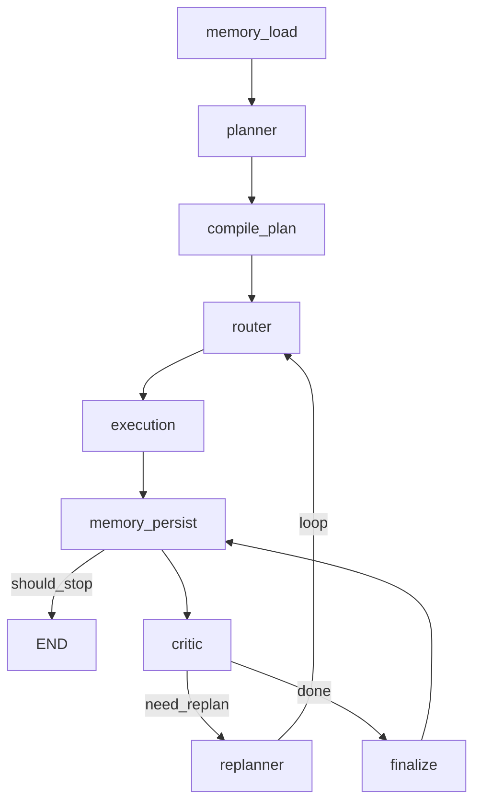
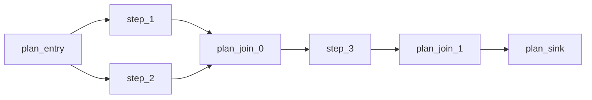
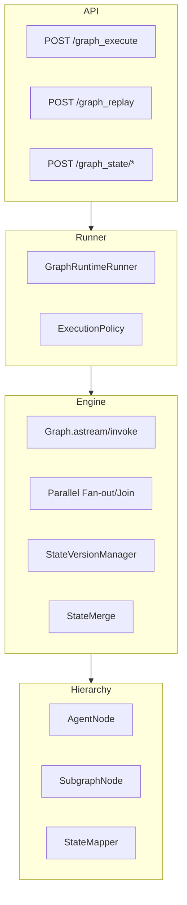

# Phase 4 — Graph-native Agent Runtime

## Objective

将 Phase 3 的 Plan Agent 能力**重新表达为 Graph-native 运行时**：

- 宏工作流（memory → plan → execute → critic → replan）为 Graph 节点
- Plan step 编译为 parallel fan-out/fan-in 子 Graph
- 统一 `AgentState` 全局状态 + 节点级 mutation
- 并行执行（asyncio.gather）+ state merge 策略
- State versioning（commit / rollback / fork / diff / replay branch）
- Hierarchical graph（SubgraphNode / AgentNode 嵌套）
- Deterministic execution + replay debugger

Phase 4 回答的问题：**如何用 Graph 统一编排、并行、版本、回放，并作为 primary runtime 替代 imperative orchestrator？**

---

## Architecture

### 宏工作流 Graph



### Plan 子 Graph（编译后）



同拓扑层无依赖的 step 通过 `add_parallel_fanout` + `asyncio.gather` 并行执行。

### 整体分层



---

## Key Components

### `Graph` — `graph/runtime/core/graph.py`

自研 Graph 执行引擎（~545 行）：

| 能力 | API |
|------|-----|
| 节点注册 | `add_node(id, fn)` |
| 边 | `add_edge` / `add_conditional_edges` / `add_loop_edge` |
| 并行 | `add_parallel_fanout(source, branches, join_node)` |
| Join | `add_join_node(join_id, wait_for, next_node)` |
| 嵌套 | `add_subgraph_node` / `add_agent_node` |
| 执行 | `invoke(state)` / `astream(state, policy)` → event stream |

每节点执行后：`StateVersionManager.commit(state, node_id=...)`。

### `AgentState` — `graph/runtime/agent_state.py`

全局 mutable state，字段包括：

- `plan` / `plan_state` / `execution_trace`
- `graph_trace` / `execution_graph`
- `memory` / `observations`
- `version_store` / `state_version_id` / `branch_id`
- `short_term_memory` / `long_term_memory` / `episodic_memory`

方法：`snapshot()` / `api_snapshot()` / `apply_snapshot()` / `from_api_snapshot()`。

### `PlanGraphCompiler` — `graph/runtime/compiler/plan_compiler.py`

将 Plan steps + dependencies 编译为 parallel DAG：

1. `_topological_levels(plan)` → `[[1], [2,3], [4]]`
2. 每层：单 step 直连 / 多 step fan-out + join
3. metadata 写入 `routing_hints` / `parallel_levels`

支持 `merge_strategy` 参数传入 compiled Graph。

### `ExecutionPolicy` — `graph/runtime/execution_policy.py`

| Mode | 行为 |
|------|------|
| `NORMAL` | 常规定执行 |
| `DETERMINISTIC` | `random.seed(seed)` 固定随机性 |
| `REPLAY` | 按 `ExecutionGraphModel.node_records` 顺序回放 snapshot |

Debug：`pause_at_nodes` + hook，配合 `capture_state_snapshots`。

### State Versioning — `graph/runtime/state_versioning.py`

| 操作 | 说明 |
|------|------|
| `commit(state, node_id)` | 每节点执行后生成 `StateVersion`（含 snapshot + diff_from_parent） |
| `rollback(state, version_id)` | 恢复到指定版本 |
| `fork_branch(state, from_version_id)` | 从版本 fork 新 branch（先 rollback 再切 branch_id） |
| `diff(state, v_a, v_b)` | 两版本 snapshot diff |

注意：snapshot **不包含** `version_store` 自身（避免指数膨胀）。

### Parallel + Merge — `graph/runtime/core/parallel.py` + `state_merge.py`

| MergeStrategy | 语义 |
|---------------|------|
| `LAST_WINS` | 最后分支覆盖 |
| `DEEP_MERGE` | observations/memory 深合并，trace 去重拼接 |
| `MERGE_LISTS` | 在 deep merge 基础上强制 list concat |
| `FAIL_ON_CONFLICT` | 标量字段冲突则抛 `StateMergeConflictError` |

并行路径：`asyncio.gather` → `merge_states` → join node → merge commit。

### Hierarchical Graph — `graph/runtime/hierarchical.py`

| 类 | 职责 |
|----|------|
| `SubgraphNode` | 嵌套 Graph 作为单节点执行 |
| `AgentNode` | SubgraphNode + agent_calls 追踪 |
| `StateMapper.identity()` | 透传 |
| `StateMapper.scoped(prefix)` | prefix 隔离 observations/memory |
| `StateMapper.for_plan_execution()` | Plan 子 Graph 的 parent ↔ child 映射 |

`execution_node` 通过 `AgentNode("plan_executor", compiled_graph, mapper=...)` 执行编译后的 Plan 子 Graph。

### Memory 集成 — `graph/runtime/memory_nodes.py`

| Node | 行为 |
|------|------|
| `memory_load` | 从 CompositeMemory 加载 short/long/episodic → AgentState |
| `memory_persist` | 写 episodic episode + long-term（含 execution graph hash） |

### Replay / Debug — `graph/runtime/replay_debug.py`

`GraphReplayDebugger`：

- `replay_node(execution_graph, node_id)` — 单节点 replay
- `replay_all(execution_graph)` — 全图顺序 replay
- `inspect_node(execution_graph, node_id, phase)` — 查看 input/output snapshot

### `GraphRuntimeRunner` — `graph/runtime/runner.py`

Phase 4 **Primary Entry**：

| 方法 | 说明 |
|------|------|
| `invoke(query, policy, merge_strategy)` | 同步执行 → `GraphExecuteResponse` |
| `stream(query, policy)` | SSE event stream |
| `replay_from_branch(snapshot, version_id, query)` | fork + 重跑 |
| `rollback_state` / `fork_branch` / `diff_versions` | 静态版本操作 |

---

## Implementation Highlights

1. **Graph 作为 Universal IR**：宏工作流和 Plan step 执行均为 Graph；Phase 3 imperative loop 变为 declarative node + edge。
2. **Parallel by construction**：PlanCompiler 按拓扑 level 自动生成 fan-out/join，非手工标注。
3. **Version per node**：每次 node mutation 产生 version，支持 time-travel debug 和 branch fork replay。
4. **Snapshot 安全设计**：`state_to_serializable` 排除 `version_store` 嵌套 + `deepcopy` on commit，避免指数膨胀。
5. **Phase 3 组件复用**：planner / executor / critic / replanner 作为 Graph node 包装，非重写业务逻辑。
6. **Deterministic replay**：同 query + seed → 相同 graph_trace 骨架（system test 验证）。

---

## Test Coverage

| 层级 | 文件 | 覆盖点 |
|------|------|--------|
| unit | `test_graph_runtime_phase4.py` | seed/replay、state hash、execution graph export、memory nodes |
| unit | `test_graph_runtime_advanced.py` | parallel fan-out、merge strategy、version fork、AgentNode、API state |
| integration | `test_graph_execute.py` | 全链路 graph_execute、replan loop、streaming API |
| system | `test_graph_runtime_system.py` | 并行 timing、merge 正确性、fork→rollback→replay 一致性、deterministic trace |

合计 **~25+** Phase 4 专用 tests + 125 total。

---

## Evolution Notes

| 自 Phase 3 | 变化 |
|------------|------|
| `PlanOrchestrator` imperative loop | `Graph.astream` event-driven |
| 串行 step | Parallel fan-out/fan-in per level |
| 无 state version | Per-node commit + rollback/fork/diff |
| 无 replay | ExecutionPolicy REPLAY + GraphReplayDebugger |
| PlanExecutionGraph（静态） | ExecutionGraphModel（含 state hash + snapshot） |
| 无 memory 节点 | memory_load / memory_persist 嵌入 workflow |
| 无 agent 嵌套 | AgentNode / SubgraphNode + StateMapper |

Phase 3 `POST /plan_execute` **保留未删**，Phase 4 为 primary。

---

## Limitations

| 缺失 | 说明 |
|------|------|
| 持久化 | version_store / session 仅在内存，无 DB |
| 观测 | 无 Prometheus / OTel metrics |
| LangGraph | 自研 engine，LangGraph 为 optional 未作为主路径 |
| State API | rollback/fork 需客户端传 `state_snapshot`，无 server-side session store |
| 分布式 | 单进程 Graph，无 multi-worker state 协调 |

---

## API / Interface

### Primary

```
POST /api/v1/graph_execute
```

Request（`GraphExecuteRequest`）：

```json
{
  "session_id": "default",
  "query": "规划上海3日游并计算预算",
  "stream": false,
  "seed": 42,
  "deterministic": true,
  "debug": false,
  "pause_at_nodes": [],
  "merge_strategy": "deep_merge"
}
```

Response（`GraphExecuteResponse`）：

```json
{
  "runtime": "graph",
  "plan": { "...": "..." },
  "graph_trace": [...],
  "execution_trace": [...],
  "node_timeline": [...],
  "final_result": "...",
  "execution_graph": { "nodes": [...], "edges": [...] },
  "execution_graph_mermaid": "...",
  "execution_seed": 42,
  "state_version_id": "...",
  "version_summary": {
    "current_version_id": "...",
    "branch_id": "main",
    "version_count": 34,
    "branches": ["main"]
  }
}
```

`stream: true` → SSE（`graph_node` / `graph_step` / `parallel_fanout` / `done` events）。

### Replay & Debug

| Method | Path | 说明 |
|--------|------|------|
| POST | `/graph_replay` | 单节点或全图 replay |
| GET | `/graph_debug/inspect` | 查看节点 input/output snapshot |

### State Versioning

| Method | Path | 说明 |
|--------|------|------|
| POST | `/graph_state/rollback` | 回滚到指定 version |
| POST | `/graph_state/fork` | 从 version fork 新 branch |
| POST | `/graph_state/diff` | 两版本 diff |
| POST | `/graph_state/replay_branch` | fork + 重跑 workflow |

### 配置

```
GRAPH_RUNTIME_ENABLED=true
GRAPH_MAX_ITERATIONS=50
PLAN_CRITIC_MAX_REPLAN_ATTEMPTS=2
TOOL_ROUTER_STRATEGY=rule_based
```
