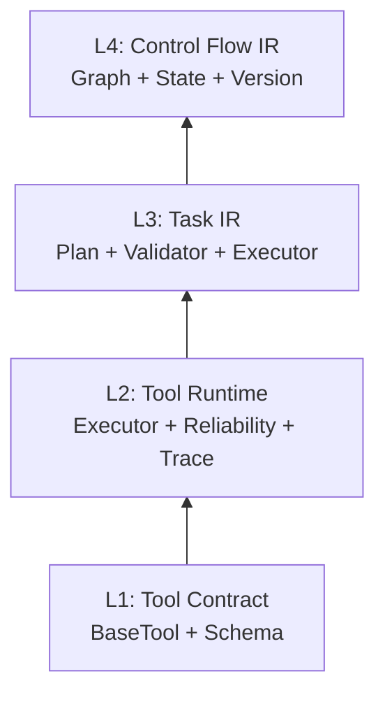

# System Evolution Summary

## 1. Evolution Tree

```
TripPlan Multi-Agent
│
├── Phase 1: Tool Abstraction Layer
│   ├── BaseTool / FunctionTool / @tool
│   ├── ToolRegistry (discover + register)
│   ├── ToolDefinition → OpenAI Schema
│   └── ExternalToolAdapter / MCP stub
│
├── Phase 2: Tool Execution Runtime
│   ├── ToolExecutor (single entry point)
│   ├── ToolReliabilityPolicy (retry / timeout / fallback)
│   ├── ToolTracer (latency / tree / export)
│   └── ToolSelectionRouter (rule / embedding / llm)
│
├── Phase 3: Plan-based Agent System
│   ├── PlannerAgent (LLM → JSON Plan)
│   ├── PlanValidator (static checks)
│   ├── PlanExecutor (DAG step execution)
│   ├── FailurePolicy (retry / skip / replan)
│   ├── ExecutionCritic + ReplanningController
│   ├── ContextCompression
│   ├── PlanExecutionGraph (visualization)
│   └── PlanOrchestrator → POST /plan_execute
│
└── Phase 4: Graph-native Agent Runtime  ★ primary
    ├── Graph Engine (invoke / astream / parallel / join)
    ├── AgentState (unified global state)
    ├── PlanGraphCompiler (Plan → parallel sub-graph)
    ├── AgentWorkflowBuilder (macro workflow graph)
    ├── ExecutionPolicy (deterministic / replay / debug)
    ├── StateVersionManager (commit / rollback / fork / diff)
    ├── StateMerge (4 strategies)
    ├── Hierarchical (AgentNode / SubgraphNode / StateMapper)
    ├── Memory Nodes (load / persist)
    ├── GraphReplayDebugger
    └── GraphRuntimeRunner → POST /graph_execute
```

---

## 2. 抽象层级递进



| 层级 | 抽象对象 | 控制流 | 状态 |
|------|----------|--------|------|
| L1 | Tool | 无 | 无 |
| L2 | ToolCall | 线性 invoke | Trace record |
| L3 | Plan / Step | DAG + replan loop | PlanState |
| L4 | Graph / Node | Graph + parallel + loop edge | AgentState + VersionStore |

**关键设计决策**：每一层 IR 向下编译，不向上泄漏。

- Plan step → Tool call（Phase 3）
- Plan → compiled sub-graph（Phase 4）
- Graph node → 包装 Phase 3 组件（planner_node, execution_node, ...）

---

## 3. 阶段间接口继承

| 自 → 至 | 继承关系 |
|---------|----------|
| P1 → P2 | `ToolExecutor` 只依赖 `ToolRegistry.get()` |
| P2 → P3 | `PlanExecutor._run_step` 调 `ToolExecutor.execute()` |
| P3 → P4 | Graph node 包装 `planner_node` / `execution_node` / `critic_node` |
| P3 ∥ P4 | `plan_execute` 与 `graph_execute` 并存，共享 Tool + Plan 组件 |

Phase 4 **不是重写**，是 **re-express + extend**：

- 并行：PlanExecutor 串行 → PlanGraphCompiler 并行
- 版本：无 → StateVersionManager
- 回放：trace 审计 → snapshot replay
- 嵌套：无 → AgentNode

---

## 4. 测试演进

| Phase | Test 重心 | 文件数 | 代表 |
|-------|-----------|--------|------|
| 1 | Schema + Registry | 2 | `test_tools_registry` |
| 2 | Reliability + Trace + Router | 4 | `test_tool_reliability` |
| 3 | Validator + Recovery + Critic + Replan | 10 | `test_plan_execute` |
| 4 | Graph + Version + Parallel + System | 4 | `test_graph_runtime_system` |

**总计 125 tests**（unit + integration + system）。

测试策略演进：

- Phase 1–2：纯 unit，mock 最小
- Phase 3：unit + integration（API 422/200）
- Phase 4：+ system tests（并行 timing、deterministic trace、version consistency）

---

## 5. 系统成熟度矩阵

| 维度 | 当前 | 目标（生产） | Gap |
|------|------|-------------|-----|
| 持久化 | 🟡 JSONL + 内存 | 🟢 Postgres/SQLite | session / version 落盘 |
| 观测 | 🟡 std logging | 🟢 OTel + metrics | 结构化 trace 导出 |
| 评估 | 🟡 125 pytest | 🟢 dataset benchmark | offline eval pipeline |
| 部署 | 🟡 uvicorn 单进程 | 🟢 Docker + 多服务 | 容器化 + worker 分离 |

---

## 6. 面试讲解要点

### 6.1 为什么分四阶段而不是一步到位？

> Tool 层解决「能力注册」；Executor 解决「可靠执行」；Plan 解决「多步任务 IR」；Graph 解决「控制流 + 并行 + 版本」。每层 IR 向下编译，上层不感知下层实现细节。允许 Phase 3 fallback 共存，降低迁移风险。

### 6.2 Phase 3 vs Phase 4 的本质区别？

> Phase 3 是 imperative orchestrator（while loop + if replan）。Phase 4 是 declarative graph（node + edge + event stream）。核心差异：(1) 并行 step 编译为 fan-out/join；(2) 每 node commit state version；(3) deterministic replay 基于 snapshot 而非仅 trace 审计。

### 6.3 并行 merge 为什么需要策略？

> 并行分支各自 deepcopy state、独立 mutate observations/memory。Join 时必须合并回单线程 state。不同策略对应不同语义：last-wins 适合互斥写；deep-merge 适合互补写；fail-on-conflict 适合强一致场景。

### 6.4 State versioning 如何防止 snapshot 爆炸？

> `state_to_serializable` 排除 `version_store` 自身；commit 时 `deepcopy` snapshot 防止后续 mutation 污染历史；version 链存于独立 `StateVersionStore`，不嵌套进 snapshot。

### 6.5 当前最大工程缺口？

> 持久化（version/session 仅内存）和 observability（无 metrics）。功能 runtime 已完整，生产化需补 storage + observability + deployment 三件套。

---

## 7. 推荐演进路线（Phase 5+）

```
Phase 5a: Persistence
  └── SQLite/Postgres for session + version_store + execution_graph

Phase 5b: Observability
  └── Structured JSON logs + Prometheus metrics + OTel trace

Phase 5c: Evaluation
  └── eval/dataset/ + benchmark runner + CI regression

Phase 5d: Deployment
  └── Dockerfile + docker-compose + optional worker split
```

---

## 8. 文件索引

| 文档 | 路径 |
|------|------|
| Overview | [00_project_overview.md](./00_project_overview.md) |
| Phase 1 | [01_phase1_tool_system.md](./01_phase1_tool_system.md) |
| Phase 2 | [02_phase2_tool_executor.md](./02_phase2_tool_executor.md) |
| Phase 3 | [03_phase3_planner_system.md](./03_phase3_planner_system.md) |
| Phase 4 | [04_phase4_graph_runtime.md](./04_phase4_graph_runtime.md) |
| Summary | [05_system_evolution_summary.md](./05_system_evolution_summary.md)（本文件） |

---

## 9. 关键代码入口速查

| 用途 | 入口 |
|------|------|
| 启动 API | `app/main.py` → `uvicorn app.main:app` |
| 依赖注入 | `app/lifespan.py` → `_bootstrap()` |
| Plan 执行 | `plan/orchestrator.py` → `PlanOrchestrator.run()` |
| Graph 执行 | `graph/runtime/runner.py` → `GraphRuntimeRunner.invoke()` |
| Tool 执行 | `tools/executor.py` → `ToolExecutor.execute()` |
| Graph 引擎 | `graph/runtime/core/graph.py` → `Graph.astream()` |
| 工作流定义 | `graph/runtime/workflow.py` → `AgentWorkflowBuilder.build()` |
| 配置 | `config/settings.py` + `.env.example` |
