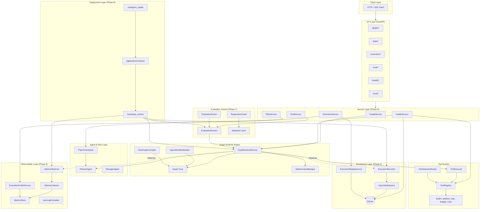
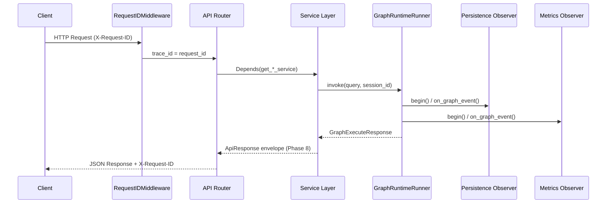
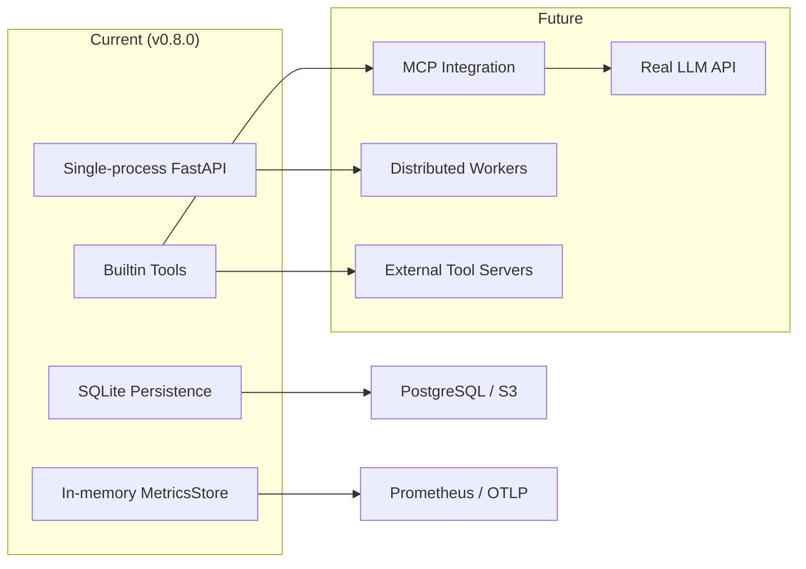

# TripPlan Multi-Agent — Phase 5–8 系统工程收束报告

> **版本：** 0.8.0 · **测试：** 150 passed · **API 前缀：** `/api/v1`  
> 本文档基于仓库真实代码结构编写，可直接用于 GitHub README、面试展示与架构说明。

---

## 1. Executive Summary

### 一句话定义

**TripPlan Multi-Agent 是一套 production-oriented 的多 Agent 基础设施**：以自研 Graph Runtime 为核心执行引擎，叠加持久化执行、可观测性、离线评估与容器化部署，支撑旅行规划场景下的 Plan-driven 与 Graph-native 双路径 Agent 工作流。

### 技术栈

| 层级 | 选型 | 代码位置 |
|------|------|----------|
| Web / API | FastAPI 0.115 + Uvicorn | `app/` |
| 配置 | pydantic-settings + `.env` | `config/settings.py` |
| Graph Runtime | 自研 Graph 引擎（非 LangGraph 依赖） | `graph/runtime/` |
| Planner Agent | LLM + 结构化 Plan | `agents/planner.py`, `plan/` |
| Tool System | Registry + Executor + Router | `tools/` |
| Persistence | SQLite + 异步写入队列 | `persistence/` |
| Observability | Metrics + Profile + JSON Logging | `observability/` |
| Evaluation | JSONL 数据集 + 批量 Runner + 回归检测 | `eval/` |
| Deployment | Docker + Compose + Service Layer | `Dockerfile`, `app/container.py` |
| LLM | OpenAI API（可选）/ RuleBasedLLM（离线） | `core/llm/` |

### 核心能力矩阵

| 能力 | 说明 | 入口 |
|------|------|------|
| **Runtime** | Graph-native 编排：并行 fan-out/fan-in、条件边、循环、状态版本化 | `GraphRuntimeRunner.invoke()` |
| **Durable Execution** | 执行录制、SQLite 持久化、回放与会话恢复 | `ExecutionRecorder`, `ExecutionReplayService` |
| **Observability** | 非侵入 Observer 指标、执行 Profile、结构化 JSON 日志 | `MetricsObserver`, `ExecutionProfileService` |
| **Evaluation** | 离线 benchmark、四维评分、baseline 回归 guard | `EvaluationRunner`, `RegressionGuard` |
| **Deployment** | DI 容器、Service Facade、Docker 健康检查、Legacy 路由兼容 | `ApplicationContainer`, `Dockerfile` |

---

## 2. Architecture Overview

### 2.1 系统分层架构



### 2.2 Graph 工作流节点链

`AgentWorkflowBuilder` 构建的主工作流（`graph/runtime/workflow.py`）：

```
memory_load → planner → compile_plan → router → execution
    → memory_persist → critic → replanner (loop) → finalize
```

### 2.3 请求生命周期



---

## 3. Phase Evolution Summary

### Phase 4 → Graph Runtime

| 维度 | 内容 |
|------|------|
| **Goal** | 用 Graph-native 引擎统一 Agent 编排，替代纯线性 Plan 循环；支持并行、条件分支、状态版本化与调试回放 |
| **Key Components** | `Graph`（`graph/runtime/core/graph.py`）、`GraphRuntimeRunner`、`AgentWorkflowBuilder`、`PlanGraphCompiler`、`StateVersionManager`、`GraphReplayDebugger`、`ExecutionPolicy` |
| **Output Capability** | `POST /graph/execute` 执行完整工作流；`/graph/state/*` 支持 rollback/fork/diff/replay_branch；SSE 流式事件 |

### Phase 5 → Persistence System

| 维度 | 内容 |
|------|------|
| **Goal** | 将 Graph 执行过程 durable 化，支持事后查询、回放与会话恢复，且不修改 Graph 核心逻辑 |
| **Key Components** | `SQLiteClient`、`AsyncWriteQueue`、`ExecutionRecorder`（Observer）、5 个 Store（execution/node/tool/state/session）、`ExecutionReplayService`、`PersistenceBundle` |
| **Output Capability** | `GET /execution/{id}` 查询执行记录；`POST /execution/replay` 回放；`POST /execution/session/restore` 会话恢复；开关 `PERSISTENCE_ENABLED` |

### Phase 6 → Observability System

| 维度 | 内容 |
|------|------|
| **Goal** | 非侵入式采集运行时指标与成本，提供执行 Profile 与结构化日志，便于生产排障与性能分析 |
| **Key Components** | `MetricsObserver`、`MetricsCollector`、`MetricsStore`、`InstrumentedLLMClient`、`ExecutionProfileService`、`log_event()`、`JsonLogFormatter`（Phase 8 polish） |
| **Output Capability** | `GET /execution/{id}/profile` 延迟分解与瓶颈分析；JSON 日志（`ENABLE_JSON_LOG` / `LOG_JSON` / `METRICS_ENABLED`）；开关 `METRICS_ENABLED` |

### Phase 7 → Evaluation System

| 维度 | 内容 |
|------|------|
| **Goal** | 建立独立于在线 serving 的离线评估流水线，量化 Agent 质量并检测回归 |
| **Key Components** | `EvaluationRunner`、`EvaluationScorer`（四维评分）、`RegressionGuard`、`EvalStore`、`eval/datasets/*.jsonl`、`EvalBundle` |
| **Output Capability** | `POST /eval/run` 批量评估；`GET /eval/report` 报告；`GET /eval/regression` baseline 对比；开关 `EVAL_ENABLED` |

### Phase 8 → Deployment System

| 维度 | 内容 |
|------|------|
| **Goal** | 将系统 production 化：Service Layer 解耦、DI 容器统一装配、Docker 部署、API 标准化与 Legacy 兼容 |
| **Key Components** | `ApplicationContainer`、`bootstrap_runtime()`、`GraphService` / `PlanService` / `ExecutionService` / `EvalService` / `HealthService`、`ApiResponse` 信封、`Dockerfile` + `docker-compose.yml`、`scripts/start.py` |
| **Output Capability** | 一键 Docker 部署；领域化 API 路径（`/graph`、`/plan`、`/execution`、`/eval`）；`GET /health/detailed` 组件级健康检查；150 tests 全绿 |

---

## 4. Key Design Decisions

### 4.1 为什么使用 Graph-based Runtime

**问题：** Phase 3 的 `PlanOrchestrator` 是线性循环，难以表达并行步骤、条件分支与复杂 replan 路径。

**决策：** 自研 `Graph` 引擎（`graph/runtime/core/graph.py`），而非强依赖 LangGraph。

**收益：**
- 原生支持 **parallel fan-out/fan-in**、**conditional edges**、**loop edges**
- `StateVersionManager` 提供 rollback / fork / diff / branch replay
- `PlanGraphCompiler` 将 Plan 编译为可执行子图，Plan 与 Graph 语义统一
- `GraphRuntimeRunner` 保留 `PlanOrchestrator` 作为 fallback，迁移风险低

### 4.2 为什么需要 Persistence + Replay

**问题：** 生产环境中 Agent 执行是多步、非确定性的；排障需要「看到当时发生了什么」，而非仅看最终输出。

**决策：** Observer 模式接入 `ExecutionRecorder`（`persistence/recorder.py`），通过 `AsyncWriteQueue` 异步写入 SQLite，**不修改 `Graph.astream()` 核心**。

**收益：**
- 完整记录：execution / node / tool / state / session 五表模型
- `ExecutionReplayService` 支持全量回放、单节点回放、执行对比、会话恢复
- `PERSISTENCE_ENABLED=false` 时零开销，开发/测试友好

### 4.3 为什么 Observability 必须非侵入

**问题：** 若在 Graph 核心或每个节点内硬编码 metrics/logging，会导致 runtime 与 observability 耦合，难以开关和测试。

**决策：**
- `MetricsObserver` 与 `ExecutionRecorder` 均通过 **Observer 回调** 订阅 `GraphRuntimeRunner._on_graph_event()`
- `InstrumentedLLMClient` 以 **Decorator** 包装 LLM，不改 Planner 逻辑
- `wire_tool_tracer(callbacks=[...])` 以 **Chain of Responsibility** 链接 persistence + metrics 回调

**收益：**
- `METRICS_ENABLED=false` 时不装配 Observer，runtime 行为不变
- ContextVar（`current_trace_id`、`current_execution_id`）跨协程传播，API 中间件与日志自动关联

### 4.4 为什么 Evaluation 是独立系统

**问题：** 在线 serving 关注延迟与可用性；质量评估需要批量跑 case、多维打分、baseline 对比——职责不同。

**决策：** `eval/` 模块独立装配（`EvalBundle`），`EvaluationRunner` 直接调用 `GraphRuntimeRunner.invoke()`，结果写入 `EvalStore`（`data/eval/`）。

**收益：**
- 评估不影响在线 API 路径与 persistence 写入
- 四维评分（tool_accuracy / plan_quality / execution_success / cost_efficiency）可配置权重
- `RegressionGuard` 与 baseline 对比，适合 CI 门禁
- 三个 JSONL 数据集（travel / budget / route）可扩展

### 4.5 为什么 Deployment 与 Runtime 解耦

**问题：** 若 API 路由直接调用 `GraphRuntimeRunner`，测试、部署、版本升级都会与 runtime 实现绑定。

**决策：** Phase 8 引入 **Service Layer + ApplicationContainer**：
- `bootstrap_runtime()` 统一 wiring，container 管理生命周期
- API 只依赖 `GraphService` 等 Facade
- Legacy 路由（`app/api/v1/legacy.py`）保持 Phase 4–7 旧路径，`include_in_schema=False`

**收益：**
- FastAPI `Depends(get_*_service)` 注入，单元测试可 mock Service
- Docker 只关心 `app.main:app` + 环境变量，不关心 runtime 内部
- `ApiResponse[T]` 统一响应信封，客户端契约稳定

---

## 5. API Summary

> 全局前缀：`/api/v1`。Phase 8 新路由按领域分组；Legacy 路由保持向后兼容。

### 5.1 `/graph/*` — Graph Runtime

| Method | Path | 说明 |
|--------|------|------|
| POST | `/graph/execute` | 执行 Graph 工作流 |
| POST | `/graph/execute/envelope` | 同上，返回 `ApiResponse` 信封 |
| POST | `/graph/replay` | Graph 级调试回放 |
| GET | `/graph/debug/inspect` | 检查 Graph 结构 |
| POST | `/graph/state/rollback` | 状态回滚 |
| POST | `/graph/state/fork` | 状态分叉 |
| POST | `/graph/state/diff` | 状态差异对比 |
| POST | `/graph/state/replay_branch` | 分支回放 |

### 5.2 `/plan/*` — Plan Orchestration

| Method | Path | 说明 |
|--------|------|------|
| POST | `/plan/execute` | Plan-driven 执行（Phase 3 路径） |
| POST | `/plan/execute/envelope` | 同上，返回 `ApiResponse` 信封 |

### 5.3 `/execution/*` — Durable Execution（Phase 5–6）

| Method | Path | 说明 |
|--------|------|------|
| GET | `/execution/{execution_id}` | 查询执行记录 |
| GET | `/execution/{execution_id}/profile` | 执行 Profile（延迟/成本/瓶颈） |
| POST | `/execution/replay` | 持久化回放 |
| POST | `/execution/session/restore` | 会话恢复并继续执行 |

### 5.4 `/eval/*` — Evaluation（Phase 7）

| Method | Path | 说明 |
|--------|------|------|
| POST | `/eval/run` | 批量运行评估数据集 |
| GET | `/eval/report?run_id=` | 获取评估报告 |
| GET | `/eval/regression?run_id=` | baseline 回归检测 |

### 5.5 `/health/*` — Health & Readiness

| Method | Path | 说明 |
|--------|------|------|
| GET | `/health` | 基础健康（status / version / environment） |
| GET | `/health/detailed` | 组件级探测（LLM / Graph / Tools / DB / Observability） |
| GET | `/ready` | 就绪检查 + feature flags（`ApiResponse` 信封） |

### 5.6 `/chat/*` — 对话入口

| Method | Path | 说明 |
|--------|------|------|
| POST | `/chat` | 会话式对话（Manager Agent） |

### 5.7 Legacy 路由（向后兼容）

| 旧路径 | 新路径等价 |
|--------|-------------|
| `POST /graph_execute` | `POST /graph/execute` |
| `POST /plan_execute` | `POST /plan/execute` |
| `POST /replay_execution` | `POST /execution/replay` |
| `POST /session/restore` | `POST /execution/session/restore` |
| `POST /graph_replay` | `POST /graph/replay` |
| `GET /graph_debug/inspect` | `GET /graph/debug/inspect` |
| `POST /graph_state/*` | `POST /graph/state/*` |

---

## 6. System Maturity Matrix

| 维度 | 成熟度 | 已实现 | 生产就绪条件 |
|------|--------|--------|--------------|
| **Runtime** | ★★★★☆ | 自研 Graph 引擎、并行/条件/循环、状态版本化、SSE 流式、Plan 编译子图 | 接入真实 LLM + 负载测试 |
| **Persistence** | ★★★☆☆ | SQLite 五表模型、异步写入、录制/回放/会话恢复、feature flag | 生产需 PostgreSQL / 分布式存储 |
| **Observability** | ★★★★☆ | Observer 指标、LLM 插桩、Profile API、JSON 结构化日志、trace_id 传播 | 对接 Prometheus / ELK / Datadog |
| **Evaluation** | ★★★★☆ | 3 数据集、四维评分、baseline 回归、EvalStore | 扩展 case 覆盖 + CI 门禁 |
| **Deployment** | ★★★★☆ | Docker + Compose、DI 容器、Service Layer、Health/Ready/Detailed、Legacy 兼容 | K8s manifest + 多 worker |

**整体评估：** 系统已具备 **production-grade 架构骨架**（分层清晰、feature flag 可控、测试覆盖完整），Persistence 存储层与分布式部署为下一迭代重点。

---

## 7. Limitations & Future Work

### 7.1 当前限制（基于代码现状）

| 限制 | 现状 | 代码证据 |
|------|------|----------|
| LLM | 默认 RuleBasedLLM，OpenAI 需配置 `OPENAI_API_KEY` | `app/bootstrap.py:create_planner()` |
| MCP | 适配器为 placeholder，未接入真实 MCP Server | `tools/adapters/mcp.py` |
| 存储 | SQLite 单文件，无分布式事务 | `persistence/db/sqlite_client.py` |
| Worker | docker-compose 中 worker/redis 为注释占位 | `docker-compose.yml` |
| LangGraph | optional 依赖，默认使用自研引擎 | `settings.langgraph_enabled=false` |

### 7.2 未来扩展方向



| 方向 | 说明 | 建议路径 |
|------|------|----------|
| **MCP Integration** | 通过 `MCPToolProvider` 动态注册外部工具 | 实现 `tools/adapters/mcp.py` 中的 client wiring |
| **Real LLM API** | 生产环境启用 OpenAI / 其他 provider | 配置 `OPENAI_API_KEY`，扩展 `core/llm/` |
| **Distributed Worker** | 长时 Graph 执行异步化 | 启用 compose 中 worker profile + 任务队列 |
| **External Tool Servers** | 工具与 runtime 进程隔离 | HTTP/gRPC tool adapter + `ToolRegistry` 远程发现 |

---

## 8. Environment & Operations Quick Reference

### Feature Flags

| 变量 | 默认 | 作用 |
|------|------|------|
| `PERSISTENCE_ENABLED` | `false` | 启用 SQLite 执行录制 |
| `METRICS_ENABLED` | `false` | 启用 Metrics Observer + Profile |
| `ENABLE_JSON_LOG` | `false` | 启用 JSON 结构化日志 |
| `EVAL_ENABLED` | `true` | 启用评估系统 |
| `GRAPH_RUNTIME_ENABLED` | `true` | 启用 Graph Runtime |

### 本地启动

```bash
conda activate multiagent
make dev          # 或 python scripts/start.py
make test         # 150 tests
make docker-up    # Docker 部署
```

### 健康检查

```bash
curl http://localhost:8000/api/v1/health
curl http://localhost:8000/api/v1/health/detailed
curl http://localhost:8000/api/v1/ready
```

---

## Appendix: Repository Map (Phase 5–8 Focus)

```
TripPlan-MultiAgent/
├── app/
│   ├── container.py          # ApplicationContainer (DI)
│   ├── bootstrap.py          # bootstrap_runtime() wiring
│   ├── services/             # GraphService, PlanService, ...
│   └── api/v1/               # health, graph, plan, execution, eval, legacy
├── graph/runtime/            # Phase 4: Graph engine + runner
├── persistence/              # Phase 5: SQLite + recorder + replay
├── observability/            # Phase 6: metrics + profile + json logging
├── eval/                     # Phase 7: runner + scorer + regression
├── Dockerfile                # Phase 8: container
├── docker-compose.yml
└── tests/                    # 150 tests (phase5–8 + production polish)
```

---

*文档生成日期：2026-06-29 · 基于 TripPlan Multi-Agent v0.8.0 源码*
