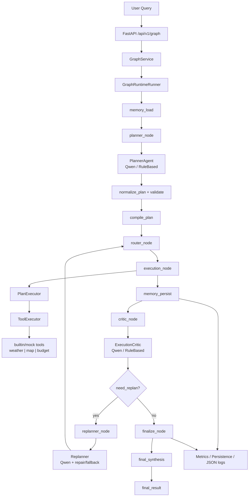

# Phase 9A：Qwen LLM API Integration — 系统工程日志

> 文档基于当前仓库真实实现编写（`app/`、`core/llm/`、`agents/`、`plan/`、`graph/runtime/`、`config/`、`scripts/`、`tests/`）。  
> 不含任何 API Key；不修改业务代码。

---

## 1. Executive Summary

### 目标

Phase 9A 将 TripPlan Multi-Agent 从 **RuleBased LLM 模拟** 升级为 **可配置真实 Qwen API** 的 Agent Runtime，使 Planner、ExecutionCritic、Replanner 等核心 caller 在配置 `QWEN_API_KEY` 后走百炼 OpenAI-compatible Chat Completions，同时保持 Graph 执行骨架与 Tool 层不变。

### 边界（本阶段明确不做）

| 范围 | Phase 9A 状态 |
|------|----------------|
| 真实 LLM（Qwen） | ✅ 已接入 |
| Tools（weather / map / budget / echo） | ✅ 仍为 `tools/builtin/` mock |
| MCP 真实服务 | ❌ 未接入（`tools/adapters/mcp.py` 仍为 placeholder） |
| 真实外部 weather/map/budget API | ❌ 未接入 |
| `graph/runtime/core/graph.py` | ❌ 未改（Graph 引擎核心保持 Phase 4 实现） |

### 一句话总结

**Phase 9A 证明真实 LLM 可以驱动 Planner / Critic / Replanner，同时通过 validator、repair、fallback、observability 与 eval 分流，使真实 LLM 输出不稳定时系统不崩溃、回归测试不被污染。**

需诚实说明：Qwen 的规划与 replan **质量仍有波动**（重复 step、顺序混乱、latency 高），本阶段重点是 **安全接入与工程韧性**，而非「Qwen 已能稳定产出最优行程」。

---

## 2. Architecture Changes

### 2.1 新增 / 重点修改模块

| 模块 | 职责 |
|------|------|
| `core/llm/qwen_client.py` | `QwenLLMClient`：httpx 调用百炼 `/chat/completions`，支持 `complete` / `complete_with_usage`、usage 解析、超时与重试 |
| `core/llm/factory.py` | `AdaptiveLLMClient`、`create_llm_client`、`create_runtime_llm`：按 `EVAL_MODE` / `LLM_PROVIDER` 路由 Qwen / OpenAI / RuleBased；API 失败时 fallback |
| `core/llm/json_utils.py` | `extract_json_text`：从 plain JSON 或 ` ```json ` 围栏中提取可解析 JSON |
| `core/llm/caller.py` | `detect_caller_from_messages`：从 system prompt 推断 planner / critic / replanner / summarizer / router |
| `core/llm/fallback_trace.py` | **9A.3** 记录 fallback 事件（caller、`error_type=timeout` 等），供 smoke 与可观测性使用 |
| `core/llm/rule_based.py` | RuleBased 模拟；**9A.3** 对「X 日游 + 预算 + 城市」稳定生成 weather→map→budget |
| `core/llm/usage.py` | `LLMCompletion` / `LLMUsage` / `estimate_token_usage` |
| `agents/planner.py` | `create_plan` / `replan_*`：JSON 解析、normalize、parse 失败时 RuleBased fallback |
| `agents/planner_prompt.py` | `TRAVEL_PLANNING_HEURISTICS`、strict JSON、tool registry 注入、replan 连续 id 约束 |
| `plan/repair.py` | `normalize_plan`、`repair_plan`、`renumber_steps`、budget 去重、synthesis step 清 `tool_hint` |
| `plan/replanning_controller.py` | Critic 驱动 replan；repair → RuleBased fallback → 不崩溃；`completed_step_overrides` |
| `plan/final_synthesis.py` | **9A.2** 从 `step_results` / `tool_outputs` / `step_outputs` 聚合分节 final_result |
| `plan/state.py` | `restore_completed_step_snapshots`、`remap_step_status`（**9A.3** 保留未 remap 的已完成结果） |
| `config/settings.py` | 全部 `QWEN_*`、`EVAL_MODE`、`smoke_max_replan_attempts` |
| `app/bootstrap.py` | `create_planner` → `create_runtime_llm`；Critic / Replanner 共用同一 instrumented LLM |
| `graph/runtime/nodes.py` | `planner_node` 调用 `normalize_plan`；`finalize_node` 调用 `synthesize_final_result` |
| `graph/runtime/runner.py` | invoke 前 `clear_fallback_events()` |
| `observability/llm/instrumented.py` | 记录 `provider` / `model` / `caller` / latency / tokens |
| `scripts/smoke_qwen_llm.py` | 端到端 Qwen smoke |
| `scripts/smoke_qwen_reporting.py` | fallback / coverage 报告辅助（**9A.3**） |
| `tests/conftest.py` | 强制 `EVAL_MODE=deterministic_eval` + `LLM_PROVIDER=rule_based`，隔离开发者 `.env` |
| `docs/system_engineering/08_qwen_llm_integration.md` | 接入说明（用户向） |

### 2.2 调用链（运行时）

```
app/bootstrap.py :: create_planner()
  └── core/llm/factory.py :: create_runtime_llm()
        └── AdaptiveLLMClient          # provider 路由 + API 失败 fallback
              └── InstrumentedLLMClient  # observability/llm/instrumented.py
                    └── PlannerAgent.create_plan / replan_*
                    └── ExecutionCritic.evaluate
                    └── PlanExecutor → ContextCompressor (summarizer，共用 planner.llm)
```

Graph 主路径：

```
GraphService.execute()
  └── GraphRuntimeRunner.invoke()
        └── AgentWorkflowBuilder 宏图
              memory_load → planner → compile_plan → router → execution
              → memory_persist → critic → [replanner 循环] → finalize
```

`ExecutionCritic` 与 `ReplanningController` 在 `app/bootstrap.py` 中注入 `RuntimeDependencies`，由 `graph/runtime/nodes.py` 的 `critic_node` / `replanner_node` 调用。

---

## 3. LLM Provider Design

### 3.1 Qwen 接入方式

- **API**：阿里云百炼 DashScope **OpenAI-compatible** Chat Completions（`POST {QWEN_BASE_URL}/chat/completions`）
- **HTTP 客户端**：`httpx`（**不引入**额外 Qwen SDK）
- **认证**：`Authorization: Bearer <QWEN_API_KEY>`（仅从环境变量读取，代码库不硬编码 key）
- **JSON 模式**：`response_format: {"type": "json_object"}`（当 `response_json=True`）

### 3.2 开启与 Fallback

| 条件 | 行为 |
|------|------|
| `LLM_PROVIDER=qwen` 且 `QWEN_API_KEY` 已设置且 `EVAL_MODE≠deterministic_eval` | 使用 `QwenLLMClient` |
| 无 key / `deterministic_eval` / provider 非 qwen | `RuleBasedLLMClient` |
| Qwen HTTP 超时、4xx/5xx、解析失败等 | `AdaptiveLLMClient` catch 后 fallback RuleBased，并 `record_fallback_event` |

`PlannerAgent` 在 parse 重试耗尽后还有一层 **显式 RuleBased fallback**（`_fallback_rule_based_plan` / `_fallback_rule_based_replan`），与 `AdaptiveLLMClient` 的 API 级 fallback 互补。

### 3.3 接口能力

- `complete(messages, ...)` → `str`
- `complete_with_usage(messages, ...)` → `LLMCompletion`（含 `text`、`usage`、`model`、`provider`）
- Usage：优先读 API `usage` 字段；缺失时用 `estimate_token_usage` 估算
- 成本估算：`METRICS_ENABLED=true` 时由 `observability/metrics/collector.py` 结合 `metrics_prompt_usd_per_1k` 等配置记录

### 3.4 Caller 级 Model 路由

`Settings.resolve_qwen_model(caller)` 映射：

| caller（逻辑角色） | settings 字段 |
|-------------------|---------------|
| `planner` | `qwen_planner_model` |
| `critic` | `qwen_critic_model` |
| `replanner` | `qwen_replanner_model` |
| `summarizer` | `qwen_summarizer_model` |
| `router` | `qwen_router_model` |
| 默认 | `qwen_model` |

`AdaptiveLLMClient` 按 `detect_caller_from_messages` 为每个 caller 缓存独立 `QwenLLMClient` 实例。

Metrics 中 replan 相关 caller 记为 **`planner_replan`**（见 `observability/llm/instrumented.py::_detect_caller`）。

### 3.5 环境变量清单

| 变量 | 默认（`config/settings.py`） | 说明 |
|------|-------------------------------|------|
| `LLM_PROVIDER` | `rule_based` | `qwen` / `openai` / `rule_based` |
| `QWEN_API_KEY` | 空 | 启用 Qwen 必填 |
| `QWEN_BASE_URL` | `https://dashscope.aliyuncs.com/compatible-mode/v1` | API 根路径 |
| `QWEN_MODEL` | `qwen3.7-plus` | 默认模型 |
| `QWEN_PLANNER_MODEL` | `qwen3.7-plus` | Planner |
| `QWEN_CRITIC_MODEL` | `qwen3.7-plus` | Critic |
| `QWEN_REPLANNER_MODEL` | `qwen3.7-plus` | Replanner |
| `QWEN_SUMMARIZER_MODEL` | `qwen3.6-flash` | Context compression（P1） |
| `QWEN_ROUTER_MODEL` | `qwen3.6-flash` | Tool router LLM 策略（P1） |
| `QWEN_TEMPERATURE` | `0.0` | 降低输出波动 |
| `QWEN_MAX_TOKENS` | `2048` | 单次 completion 上限 |
| `QWEN_TIMEOUT_SEC` | `120.0` | HTTP 超时（秒）；smoke 建议 120–180 |
| `QWEN_MAX_RETRIES` | `1` | Qwen 客户端层重试次数 |
| `EVAL_MODE` | `deterministic_eval` | 见第 5 节 |
| `SMOKE_MAX_REPLAN_ATTEMPTS` | 空 | 可选；smoke 覆盖 `plan_critic_max_replan_attempts` |

---

## 4. Caller Integration

### 4.1 P0 — 已接入真实 LLM

| Caller | 入口 | 作用 |
|--------|------|------|
| **Planner** | `PlannerAgent.create_plan` | 将自然语言 query 转为结构化 `Plan`（goal + steps + tool_hint + dependency） |
| **ExecutionCritic** | `ExecutionCritic.evaluate` | 根据 step 结果与 tool 输出判断 goal 是否完成、`need_replan` |
| **Replanner** | `PlannerAgent.replan_from_critique` + `ReplanningController.handle` | Critic 判定需 replan 时改写未完成步骤；校验失败走 repair / RuleBased fallback |

三者共享 `bootstrap_runtime` 中创建的 **同一** `InstrumentedLLMClient(AdaptiveLLMClient(...))`。

### 4.2 P1 — 配置预留、默认仍偏 RuleBased

| Caller | 位置 | 说明 |
|--------|------|------|
| **Summarizer** | `plan/context_compression.py` → `PlanExecutor` 注入 `planner.llm` | `plan_context_compression_enabled` 时可能触发；system prompt 含 compress 关键字 |
| **Tool router** | `tools/router/` + `tool_router_strategy=llm` | 默认 `rule_based`；LLM 策略可走 Qwen router 模型 |

### 4.3 为何这些 caller 需要真实 LLM

- **Planner**：旅行需求开放、步骤组合多；RuleBased 只能覆盖 pattern，无法评估真实 prompt 遵循与分解能力。
- **Critic**：需语义判断「预算算了但行程没给」类缺口；RuleBased 用启发式规则，与真实用户期望有差距。
- **Replanner**：需在保留已完成 step 的前提下改写剩余计划；真实 LLM 易产出非连续 id、重复 budget step，故必须配 repair 层。

---

## 5. Deterministic Eval vs Real LLM Eval

### 5.1 `EVAL_MODE` 三分流

| 模式 | 行为 | 用途 |
|------|------|------|
| `deterministic_eval`（**默认**） | `factory.should_use_qwen` 为 false，强制 RuleBased | CI / `make test` / 回归 |
| `auto` | 跟随 `LLM_PROVIDER` + key | smoke、本地联调、生产推荐 |
| `real_llm_eval` | 使用配置的 real provider（通常 qwen） | 小规模真实 LLM eval |

实现见 `core/llm/factory.py::is_deterministic_eval` / `should_use_qwen`。

### 5.2 测试隔离

`tests/conftest.py` 在 import 阶段设置：

```python
os.environ["EVAL_MODE"] = "deterministic_eval"
os.environ["LLM_PROVIDER"] = "rule_based"
```

每个 test 的 `autouse` fixture 再次 `monkeypatch` 并 `get_settings.cache_clear()`，避免开发者本地 `.env` 中 `LLM_PROVIDER=qwen` 导致 CI 调真实 API。

### 5.3 原则

**真实 LLM 输出非确定性，不得作为默认 regression gate。**  
Deterministic eval 继续覆盖 Graph、repair、final_synthesis、synthesis 等逻辑；Qwen 质量通过 smoke 与可选 `real_llm_eval` 观察。

真实 LLM 数据集：`eval/datasets/real_llm/qwen_smoke.jsonl`（3 条 case）。

---

## 6. Real LLM Robustness Issues and Fixes

以下按 smoke 与联调中**实际暴露**的问题归纳，对应代码路径均为仓库内真实实现。

### 问题 A：Planner 输出重复 step、tool_hint 不稳定、顺序混乱

**现象**（Qwen smoke，`帮我规划上海3日游并计算预算`）：

- 多个 `budget` step、缺少 `weather` / `map` 或顺序颠倒
- 偶发 Markdown 包裹 JSON

**修复**：

| 措施 | 文件 |
|------|------|
| strict JSON + `TRAVEL_PLANNING_HEURISTICS` | `agents/planner_prompt.py` |
| `extract_json_text` + parse 重试 | `core/llm/json_utils.py`、`agents/planner.py` |
| `normalize_plan`：budget 去重、synthesis 类 task 清 `tool_hint`、weather→map→budget 排序、renumber | `plan/repair.py` |
| `planner_node` 创建 plan 后 normalize | `graph/runtime/nodes.py` |

**残留**：Qwen 仍可能产出语义重复或缺 map 的 plan；靠 Critic 触发 replan，不保证一次成功。

### 问题 B：Replanner 返回非连续 step id → `PlanValidationError`

**现象**：首次 smoke 连通后，Replanner JSON 中 id 为 2、3、6 等，校验失败，流程中断。

**修复**：

| 措施 | 文件 |
|------|------|
| `renumber_steps` / `repair_plan` / `repair_steps` | `plan/repair.py` |
| dependency remap、丢弃非法 dependency | 同上 |
| replan apply 后 `_validate_or_repair_plan`，失败再 RuleBased fallback | `plan/replanning_controller.py` |
| replan prompt：连续 id、从 1 开始 | `agents/planner_prompt.py` |

**9A.1 验收**：repair / fallback 后 **不再因校验崩溃**。

### 问题 C：Replanner 修改已完成（completed）step

**现象**：budget 已执行，replan 输出改写已完成 step 的 task / tool_hint。

**修复**：

| 措施 | 文件 |
|------|------|
| replan prompt：completed steps immutable | `agents/planner_prompt.py` |
| `PlanState.restore_completed_step_snapshots` | `plan/state.py` |
| `ReplanningResult.completed_step_overrides` | `schemas/replanning.py` |
| `_assert_completed_steps_preserved` | `plan/replanning_controller.py` |

### 问题 D：Qwen API timeout → Planner fallback 计划缺 weather

**现象**：Planner 首次 Qwen 调用超时（如 `QWEN_TIMEOUT_SEC=60`），`AdaptiveLLMClient` fallback RuleBased；旧 RuleBased 默认 plan 常缺 `weather`，导致 final_result 只有 route + budget。

**修复（9A.3）**：

| 措施 | 文件 |
|------|------|
| 默认 / 文档建议 `QWEN_TIMEOUT_SEC=120`（smoke 建议 120–180） | `config/settings.py`、`.env.example` |
| `record_fallback_event`、`classify_llm_error(timeout)` | `core/llm/fallback_trace.py` |
| API 失败 fallback + smoke 打印 `planner_fallback_used` / `planner_error_type` | `core/llm/factory.py`、`scripts/smoke_qwen_llm.py` |
| RuleBased `_build_trip_weather_map_budget_plan`、replan 同步覆盖 | `core/llm/rule_based.py` |

### 问题 E：Tool 执行成功但 `final_result` 信息丢失或重复

**现象**：

- 多次 budget 结果重复出现在 final 文本
- replan 重编号后 `step_results` 与 `step_outputs` 不同步，天气节丢失
- coverage 误报（goal 中含「行程」字样即判有 route section）

**修复（9A.2 + 9A.3）**：

| 措施 | 文件 |
|------|------|
| `synthesize_final_result`：分节「目标 / 天气信息 / 行程路线 / 预算估算 / 总结」 | `plan/final_synthesis.py` |
| 从 `step_results`、`step_outputs`（按 plan step `tool_hint`）、`tool_outputs` 聚合；budget 去重 | 同上 |
| `check_final_result_coverage` 匹配真实分节标题 | 同上 |
| context compression 保留 `step_outputs` | `plan/context_compression.py` |
| `remap_step_status` 保留未参与 id_map 的已完成结果 | `plan/state.py` |
| `finalize_node` 每次重新合成 | `graph/runtime/nodes.py` |

**残留**：若 Qwen replan 未生成 map step 且 weather 结果在复杂 replan 链中未写入 context，smoke 仍可能出现 **coverage 不全**；系统 exit 0，但展示质量依赖 plan 结构。

---

## 7. Runtime Flow After Phase 9A

### 7.1 文字流程

1. **User Query** → FastAPI `app/api/v1/graph.py`
2. **GraphService.execute** → `GraphRuntimeRunner.invoke`
3. **memory_load** → 加载 session memory
4. **planner_node** → `PlannerAgent.create_plan`（Qwen 或 RuleBased）→ `normalize_plan` → `PlanValidator`
5. **compile_plan** → `PlanGraphCompiler` 编译子图（支持并行 step）
6. **router_node** → 为无 `tool_hint` 的 step 选工具（默认 rule_based router）
7. **execution_node** → `PlanExecutor` → **ToolExecutor** → **builtin/mock tools**
8. **memory_persist** → 可选 Persistence / Metrics 订阅
9. **critic_node** → `ExecutionCritic.evaluate`（Qwen 或 RuleBased）→ `need_replan?`
10. **replanner_node**（循环）→ `ReplanningController` → repair / RuleBased fallback → 重新 compile → 回到 router/execution
11. **finalize_node** → `synthesize_final_result`
12. **Persistence / Metrics / JSON logs**（配置开启时）

**强调**：Tools 仍为 `tools/builtin/` mock；**Phase 9B** 才接 MCP。

### 7.2 Mermaid 总览



---

## 8. Smoke Validation Summary

### 8.1 脚本

```bash
python scripts/smoke_qwen_llm.py
```

- 读取 `.env`，强制 `LLM_PROVIDER=qwen`、`EVAL_MODE=auto`、`METRICS_ENABLED=true`
- Query 固定：`帮我规划上海3日游并计算预算`
- 打印：plan steps、execution trace、replan history、**planner_fallback**、**final_result coverage**、LLM call summary

辅助模块：`scripts/smoke_qwen_reporting.py`。

### 8.2 演进时间线

| 阶段 | 主要结果 |
|------|----------|
| **首次 smoke** | Qwen API 连通；Planner 有 plan；Replanner 非连续 step id → `PlanValidationError`，流程可能中断 |
| **9A.1** | `plan/repair.py` + `ReplanningController` repair / RuleBased fallback；**校验失败不再崩溃** |
| **9A.2** | `final_synthesis` 分节聚合；`normalize_plan` 去重；`restore_completed_step_snapshots`；coverage 字段进入 smoke / `state_summary` |
| **9A.3** | `QWEN_TIMEOUT_SEC` 建议 120；`fallback_trace`；RuleBased trip fallback 覆盖 weather/map/budget；`remap_step_status` 保留已完成结果；`SMOKE_MAX_REPLAN_ATTEMPTS` 可选 |

### 8.3 当前状态（文档编写时）

| 指标 | 状态 |
|------|------|
| `python scripts/smoke_qwen_llm.py` | **exit code 0** |
| `pytest tests/` | **182 passed**（含 `test_qwen_llm.py`、`test_qwen_smoke_stability.py`、`test_plan_repair.py`、`test_plan_result_quality.py` 等） |
| Metrics | `provider=qwen`、`caller=planner|critic|planner_replan` 可记录 latency / tokens |
| Planner fallback | 超时或 API 失败时可观测 `planner_fallback_used` / `planner_error_type=timeout` |

### 8.4 诚实观察（真实 smoke）

- **Latency**：单次 smoke 常 **150–200+ 秒**（含多次 Qwen replan + critic，单次 replan 可达 100s+）
- **Plan 质量波动**：Qwen 仍可能生成「先 budget、后 weather、重复 budget」等结构；依赖 Critic 多轮 replan + repair
- **Coverage 不稳定**：即使 `weather: ok`，若 replan 后 plan 缺 map 或 context 同步问题，`final_result` 三节未必全 true
- **Fallback 路径**：Planner timeout → RuleBased 现可稳定产出 weather→map→budget（单元测试覆盖）；与「Qwen 直接规划成功」是不同路径

---

## 9. Current Limitations

1. **Qwen Planner / Replanner 输出仍不稳定** — 重复 step、tool 顺序、缺 map 等；`QWEN_TEMPERATURE=0` 仅减轻、不消除波动。
2. **Smoke / 真实请求 latency 高** — 不适合作为 CI 默认 gate。
3. **Tools 仍为 builtin/mock** — 天气、路线、预算均为 hash 派生的本地数据，不代表真实世界 API。
4. **MCP 未接入** — `tools/adapters/mcp.py` 为 placeholder；ToolExecutor 未调用真实 MCP server。
5. **真实外部 API 未接** — 无真实地图、气象、报价服务。
6. **`real_llm_eval` 非大规模 benchmark** — 仅 `qwen_smoke.jsonl` 3 条；无系统化质量回归阈值。
7. **Graph 核心未改** — 韧性逻辑在 plan / llm / nodes 层；未引入新 orchestration 框架。
8. **OpenAI 路径仍并存** — `LLM_PROVIDER=openai` 可用，但 Phase 9A 工程验证以 Qwen 为主。

---

## 10. Next Step — Phase 9B（MCP）

建议下一阶段：

1. 接入 **最小 MCP server**（只读、少工具）
2. MCP tool schema → `BaseTool` 适配（`tools/adapters/mcp.py`）
3. 注册到 `ToolRegistry`，与 builtin 工具共存
4. 经现有 `ToolExecutor` 调用，不改 Graph 主循环
5. 确保 **trace / metrics / persistence** 记录 MCP tool calls（与 Phase 6/5 observer 对齐）
6. 保持 `EVAL_MODE=deterministic_eval` 下 MCP 可 mock 或可关闭

---

## 11. Interview Notes（约 1 分钟）

> TripPlan 在 Phase 9A 做的不是「调通一个 Qwen API」，而是把 **真实 LLM 安全接进已有 Graph-native Agent Runtime**。
>
> 我们通过 `AdaptiveLLMClient` 做 provider 路由和 API 级 fallback，用 `InstrumentedLLMClient` 把每次调用的 caller、model、latency、token 打进 metrics；Planner、Critic、Replanner 三个 P0 caller 共用这一套 LLM 栈，但工具层 deliberately 仍是 builtin mock，把「LLM 不稳定」和「工具未就绪」拆开验证。
>
> 真实联调暴露四类问题：JSON 与非连续 step id、replan 改 completed step、API timeout、以及 tool 成功了 final 却丢信息。对应地加了 prompt 约束、`plan/repair` 规范化、`ReplanningController` 的 repair 与 RuleBased 二次 fallback、`final_synthesis` 结构化聚合，以及 `EVAL_MODE` 把 CI 锁在 RuleBased，避免真实 LLM 污染回归。
>
> 当前 smoke 能稳定 **exit 0**，182 个测试通过，但 Qwen 的规划质量仍有波动、延迟高——这说明 Phase 9A 的价值在于 **工程韧性与可观测性**，而不是声称 LLM 已能稳定产出最优行程。下一步 Phase 9B 再接 MCP，把工具层从 mock 扩展到真实外部能力。

---

## 附录：相关测试与文档索引

| 类型 | 路径 |
|------|------|
| Qwen 单元测试 | `tests/unit/test_qwen_llm.py` |
| Smoke 稳定性 | `tests/unit/test_qwen_smoke_stability.py` |
| Plan repair | `tests/unit/test_plan_repair.py` |
| Final 质量 | `tests/unit/test_plan_result_quality.py` |
| 测试隔离 | `tests/conftest.py` |
| 用户向接入说明 | `docs/system_engineering/08_qwen_llm_integration.md` |
| 运行时叙事 | `docs/system_engineering/07_runtime_flow_narrative.md` |
