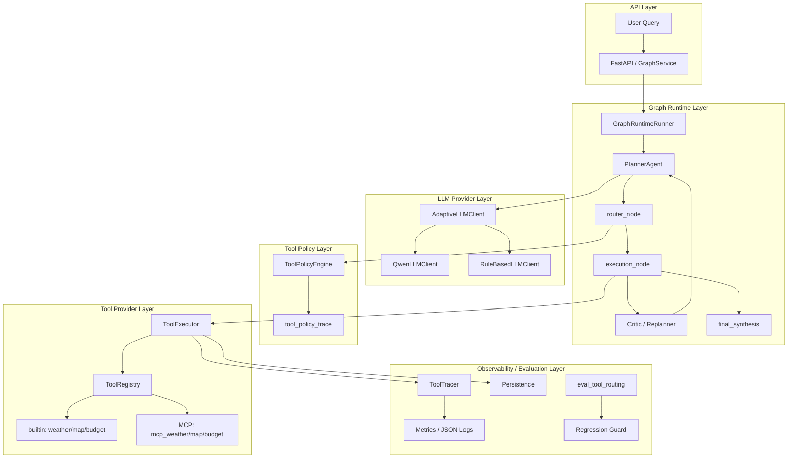

# Phase 9 总结：Real LLM + MCP + Tool Routing

> 系统性总结 Phase 9A–9D 的完成情况、架构演进、当前边界与后续方向。  
> 基于 [09_phase9a_qwen_llm_integration.md](./09_phase9a_qwen_llm_integration.md)、[10_phase9c_tool_routing_intelligence.md](./10_phase9c_tool_routing_intelligence.md)、[11_phase9d_tool_routing_regression.md](./11_phase9d_tool_routing_regression.md)、[07_runtime_flow_narrative.md](./07_runtime_flow_narrative.md) 与当前仓库实现整理。  
> 不含任何 API Key；不夸大系统能力。

---

## 1. Executive Summary

Phase 9 将 TripPlan Multi-Agent 从 **deterministic / mock Agent Runtime**，升级为具备 **真实 LLM 接入、MCP 外部工具协议、Tool Routing Policy、MCP↔builtin fallback、Tool Routing Evaluation、Regression Guard** 的 Agent Infra 原型。

**核心目标不是「旅行规划效果变强」**，而是：

> 真实 LLM 与外部工具协议可以 **安全接入** 现有 Graph Runtime，并形成 **可观测、可回退、可评估** 的工具调用闭环。

travel 场景（weather / map / budget）仍是 **验证用例**，不是产品交付物。builtin 与 MCP 工具当前均为 **mock / 本地模拟**，未接真实天气、地图或预算 API。

| 子阶段 | 主题 | 一句话 |
|--------|------|--------|
| **9A** | Qwen LLM API | Planner / Critic / Replanner 可配置真实 Qwen，带 repair / fallback / synthesis |
| **9B** | Minimal MCP | 本地 stdio MCP server，`mcp_*` 工具注册进 ToolRegistry |
| **9C** | Tool Routing | builtin vs MCP 可解释选择、执行 fallback、离线 routing eval |
| **9D** | Regression + Reliability | baseline 对比、regression guard、`reliability_aware` v1、multi-tool eval |

**Graph 引擎核心**（`graph/runtime/core/graph.py`）在 9A–9D **未改**；演进集中在 LLM 层、Tool 层、Policy 层与 Eval 层。

---

## 2. Phase 9A — Qwen LLM API Integration

### 目标

将 Planner / Critic / Replanner 从 RuleBased 模拟升级为 **可配置 Qwen API**，同时保持 Graph 执行骨架与 Tool 层不变。

### 核心模块

| 模块 | 职责 |
|------|------|
| `core/llm/qwen_client.py` | httpx 调用百炼 OpenAI-compatible Chat Completions |
| `core/llm/factory.py` | `AdaptiveLLMClient`、`create_runtime_llm`、API 失败 fallback |
| `core/llm/json_utils.py` | 从 LLM 输出提取可解析 JSON |
| `core/llm/fallback_trace.py` | 记录 fallback 事件（timeout 等） |
| `agents/planner.py` / `planner_prompt.py` | Plan 生成、JSON 解析、replan 约束 |
| `plan/repair.py` | `normalize_plan`、step 去重与 renumber |
| `plan/final_synthesis.py` | 从 step / tool 输出聚合 `final_result` |
| `scripts/smoke_qwen_llm.py` | 真实 Qwen 端到端 manual smoke |

### 核心设计

- **AdaptiveLLMClient** + **InstrumentedLLMClient**：provider 路由 + 观测
- **Caller-level model routing**：planner / critic / replanner / summarizer 可配不同 Qwen 模型
- **deterministic_eval vs real_llm_eval**：CI / 回归默认 RuleBased，不调用真实 API
- **JSON parsing / plan repair / fallback**：Qwen 输出不稳定时不崩溃
- **completed step protection**：replan 不覆盖已完成步骤
- **final_result synthesis**：weather / map / budget 分节聚合

### 诚实边界

- Qwen planning / replan **质量仍有波动**（重复 step、顺序混乱）
- smoke **latency 高**（尤其 `qwen3.7-plus`）
- Phase 9A 工具层仍是 **builtin mock**，无 MCP
- 价值在于 **真实 LLM 安全接入与工程韧性**，而非「Qwen 已稳定产出最优行程」

详见：[09_phase9a_qwen_llm_integration.md](./09_phase9a_qwen_llm_integration.md)

---

## 3. Phase 9B — Minimal MCP Tool Integration

### 目标

将工具层从 **builtin Python 工具** 扩展到 **MCP tool protocol**，验证「外部工具协议」可接入现有 ToolExecutor 链路。

### 核心模块

| 模块 | 职责 |
|------|------|
| `mcp_servers/trip_tools_server.py` | 本地 FastMCP stdio server（mock 三工具） |
| `tools/mcp/client.py` | `MCPStdioClient` |
| `tools/adapters/mcp.py` | MCP schema → `BaseTool` |
| `tools/mcp/bootstrap.py` | `wire_mcp_tools` 注册进 ToolRegistry |
| `scripts/smoke_mcp_tools.py` | MCP 路径 smoke（RuleBased + MCP） |

### 核心设计

- 本地 **stdio FastMCP** server，无第三方 MCP 依赖
- 工具名：`mcp_weather` / `mcp_map` / `mcp_budget`（**不覆盖** builtin `weather` / `map` / `budget`）
- MCP 工具仍走 **ToolExecutor → ToolTracer → Metrics / Persistence**
- `MCP_ENABLED=false` 默认关闭；`MCP_REQUIRED=true` 才在 bootstrap 失败时强制报错

### 诚实边界

- MCP tools 当前仍为 **本地 mock**，返回 deterministic 假数据
- 本阶段验证的是 **MCP 协议链路**（发现、schema、调用、trace），不是真实天气/地图数据
- `requirements-mcp.txt` 需与 FastAPI/starlette 版本约束兼容安装

---

## 4. Phase 9C — Tool Routing Intelligence + MCP Evaluation

### 目标

在 builtin 与 MCP 并存时，做 **可解释工具选择**、**执行失败 fallback**、**tool_policy_trace** 与 **离线 routing eval**。

### 核心模块

| 模块 | 职责 |
|------|------|
| `tools/policy/models.py` | `ToolPolicyDecision`、family / provider 映射 |
| `tools/policy/engine.py` | `ToolPolicyEngine.decide()` |
| `tools/policy/trace.py` | `ToolPolicyTracer` → observations / JSON log |
| `tools/policy/bootstrap.py` | 从 settings 构建 engine |
| `eval/tool_eval/` | loader / evaluator / report |
| `eval/datasets/tool_routing.jsonl` | 12+ single-tool labeled cases |
| `scripts/eval_tool_routing.py` | 离线 routing 评估 |
| `scripts/smoke_qwen_mcp_tools.py` | Qwen + MCP + Policy **manual** smoke |

### 核心策略

| 策略 | 行为 |
|------|------|
| `planner_hint_first` | 默认尊重 Planner `tool_hint` |
| `builtin_first` | 同 family 优先 builtin |
| `mcp_first` | 同 family 优先 MCP |
| `deterministic` | CI 用，等价 builtin_first |
| `cost_aware` | 预留 stub |
| `reliability_aware` | 9C 为 stub；9D 实现 v1 |

### 核心指标

- `tool_selection_accuracy` — 精确工具名一致
- `family_accuracy` — weather / mcp_weather 等同 family
- `provider_accuracy` — builtin vs MCP 选对比例
- `mcp_usage_rate` / `fallback_rate`

### 验证结果（Phase 9C 完成时）

| 检查项 | 结果 |
|--------|------|
| pytest | **208 passed** |
| `smoke_mcp_tools.py` | exit code **0** |
| `tool_selection_accuracy` | **90.9%** |
| `provider_accuracy` | **91.7%** |

**说明：** 上述为 **离线 ToolPolicyEngine eval**，不等于完整 Graph 任务成功率，也不代表 Qwen 规划质量。

详见：[10_phase9c_tool_routing_intelligence.md](./10_phase9c_tool_routing_intelligence.md)

---

## 5. Phase 9D — Tool Routing Regression Gate + Reliability-aware Policy

### 目标

将 tool routing eval 从「单次离线报告」升级为 **baseline / regression guard**；实现 `reliability_aware` v1 与少量 **multi-tool routing eval**。

### 核心模块

| 模块 | 职责 |
|------|------|
| `eval/tool_eval/baseline.py` | 保存 / 加载 versioned baseline |
| `eval/tool_eval/regression_guard.py` | `ToolRoutingRegressionGuard` |
| `tools/policy/reliability.py` | stats 加载、provider score 比较 |
| `eval/datasets/tool_routing_multi.jsonl` | multi-tool cases |
| `eval/baselines/tool_routing_baseline.json` | 版本化 regression 基准 |
| `scripts/eval_tool_routing.py` | CLI：`--save-baseline` / `--compare-baseline` / `--fail-on-regression` |

### 核心能力

- **Baseline**：`baseline_schema_version=v1`、`dataset_hash`、aggregate 指标
- **Regression guard**：对比当前 report vs baseline
- **reliability_aware v1**：静态 JSON stats 比较 builtin / MCP score
- **Multi-tool eval**：`tool_recall` / `tool_precision` / `family_recall` / `provider_recall`
- **latest_report.json**：最近一次运行产物（不提交 git）

### Regression 规则

| 条件 | 结果 |
|------|------|
| accuracy / provider / family **下降超阈值** | `regression_detected=true` |
| fallback_rate **上升超阈值** | `degraded=true`（不单独触发 regression） |
| `--fail-on-regression` | 仅当 `regression_detected=true` 时 exit 非 0 |
| `degraded` | 当前 **不会** 单独触发 fail；`--fail-on-degraded` 为后续可选 |

### 验证结果（Phase 9D 完成时）

| 检查项 | 结果 |
|--------|------|
| pytest | **222 passed** |
| `--save-baseline` | 正常 |
| `--compare-baseline` | 正常，`regression_detected=false` |
| `latest_report.json` | 正常生成 |

详见：[11_phase9d_tool_routing_regression.md](./11_phase9d_tool_routing_regression.md)

---

## 6. End-to-End Architecture After Phase 9

### 文字流程

```
User Query
  → FastAPI / GraphService
  → GraphRuntimeRunner
  → PlannerAgent (Qwen 或 RuleBased，由 EVAL_MODE / LLM_PROVIDER 决定)
  → normalize_plan / PlanValidator / repair
  → router_node
  → ToolPolicyEngine (planner_hint_first / mcp_first / reliability_aware …)
  → 更新 step.tool_hint，写入 tool_policy_trace
  → PlanExecutor / execution_node
  → ToolExecutor (retry → policy fallback)
  → ToolRegistry
       ├─ builtin: weather / map / budget / echo  (mock)
       └─ MCP: mcp_weather / mcp_map / mcp_budget  (本地 mock MCP server)
  → ToolTracer / MetricsObserver / PersistenceRecorder
  → ExecutionCritic → [Replanner 循环]
  → final_synthesis → GraphExecuteResponse
  → (离线) eval_tool_routing.py / regression guard
```

`graph/runtime/core/graph.py` **未改**；上述能力通过 nodes、deps、bootstrap 与外层模块注入。

### 架构图（Mermaid）



---

## 7. Current Capability Matrix

| Capability | Status | Notes |
|------------|--------|-------|
| Graph Runtime | done | 9A–9D 未改 `graph/runtime/core/graph.py` |
| Qwen LLM integration | done | Planner / Critic / Replanner / Summarizer |
| deterministic eval | done | 默认 RuleBased；pytest 强制隔离 |
| MCP protocol integration | done | 本地 mock stdio MCP server |
| tool routing policy | done | builtin / MCP 可解释选择 |
| tool failure fallback | done | MCP↔builtin，记录 recovery_action |
| tool routing eval | done | 离线 dataset + 指标 |
| regression guard | done | baseline compare + `--fail-on-regression` |
| reliability-aware policy | v1 | 静态 stats JSON，非线上采集 |
| multi-tool routing eval | v1 | 少量 case，recall / precision |
| real weather/map/budget API | not yet | builtin 与 MCP 均为 mock |
| third-party MCP server | not yet | 仅本地 trip_tools_server |
| Qwen + MCP CI | not included | manual smoke only |
| Graph-level quality benchmark | not yet | 无真实旅行质量 benchmark |

---

## 8. Evaluation and Testing Summary

### 测试层次

| 层次 | 代表 | 验证什么 |
|------|------|----------|
| **1. Unit tests** | `test_tool_policy_engine.py` 等 | Policy、repair、LLM 解析等单元逻辑 |
| **2. Integration tests** | `test_mcp_tool_policy_integration.py` | MCP + policy + executor 集成 |
| **3. Smoke tests** | `smoke_*.py` | 端到端 manual 验证（部分需 API Key / MCP） |
| **4. Tool routing eval** | `eval_tool_routing.py` | 离线 routing accuracy / provider |
| **5. Regression guard** | `--compare-baseline` | routing 指标相对 baseline 是否退化 |

### Smoke 脚本说明

| 脚本 | 类型 | 说明 |
|------|------|------|
| `smoke_qwen_llm.py` | manual | 需 `QWEN_API_KEY`；真实 Qwen Planner 路径 |
| `smoke_mcp_tools.py` | manual | 需 MCP 依赖；RuleBased + MCP tools |
| `smoke_qwen_mcp_tools.py` | manual | Qwen + MCP + Policy；**不进入默认 CI** |

### 强调

- **当前没有真实旅行质量 benchmark**
- 现有 eval 主要评估 **infra behavior**（LLM 接入、MCP 协议、routing 决策、fallback、regression），**不是**真实行程好坏
- pytest（222 passed）覆盖 deterministic path；真实 Qwen / MCP smoke 需开发者本地手动跑

---

## 9. Current Limitations

1. **builtin** `weather` / `map` / `budget` 为 mock / stable tools，非真实外部 API
2. **MCP** `mcp_weather` / `mcp_map` / `mcp_budget` 来自 **本地 mock MCP server**，同样非真实数据
3. 尚未接真实天气、地图、预算 API 或第三方 MCP server
4. Qwen planning / replan **仍不稳定**；smoke latency 高
5. `reliability_aware` 使用 **静态 JSON stats**，非线上真实 success rate 采集
6. multi-tool eval 为 **轻量 v1**（3 cases），非完整 Graph 多步联合优化
7. regression guard 覆盖 **tool routing 离线指标**，不覆盖完整 Graph 任务质量或 Qwen 规划质量
8. `cost_aware` 仍为 stub
9. Qwen + MCP 相关 smoke **均为 manual**，默认 CI 使用 RuleBased + `MCP_ENABLED=false`
10. 无真实用户任务 benchmark 或旅行产品级 eval

---

## 10. Recommended Next Steps

### A. 必要收束（文档 / 展示）

- README 展示版：突出 Phase 9 infra 能力，不包装成旅行产品
- 架构图更新：与本文 §6 Mermaid 对齐
- demo script 固化：deterministic demo + optional manual smoke 说明
- 简历项目描述：Agent Runtime / Infra，非 travel chatbot
- 面试讲解稿：见 §11

### B. 可选增强（按优先级）

| 优先级 | 方向 | 说明 |
|--------|------|------|
| 低门槛 | CI 接入 `--compare-baseline --fail-on-regression` | routing regression 门禁 |
| 低门槛 | `--fail-on-degraded` | fallback_rate 异常时也 fail |
| 中 | policy trace → 自动刷新 reliability stats | 替代静态 JSON |
| 中 | Graph-level eval dataset | 超越单步 routing |
| 中 | Qwen + MCP stability eval | 多样本 manual / 半自动 |
| 高（谨慎） | **一个** real weather MCP smoke | 证明 mock → real MCP 可替换 |

**建议：** 不宜马上大规模接入真实 API。若接，优先 **只接一个最小 real weather MCP smoke**，验证 provider 可替换性即可；map / budget 可继续 mock。

---

## 11. Interview Summary

### 30 秒版本

> 这是一个 Graph-native 多 Agent **Runtime 基础设施**项目，不是旅行聊天产品。Phase 9 把它从 RuleBased 模拟升级为：可接 **真实 Qwen LLM**、可接 **MCP 工具协议**、并有 **Tool Routing Policy** 在 builtin 与 MCP 之间做选择与 fallback。工具调用全程可 trace、可 metrics，还有离线 **tool routing eval** 和 **regression guard**。weather/map/budget 仍是 mock，验证的是 Agent Infra 闭环，不是真实行程质量。

### 2 分钟版本

> **背景：** 项目解决的是「Plan-driven、Graph-native、可观测、可评估的 Agent 执行基础设施」。旅行规划只是验证场景。
>
> **Phase 9A** 接入 Qwen API：Planner / Critic / Replanner 可走真实 LLM，同时用 `deterministic_eval` 隔离 CI，用 JSON repair、RuleBased fallback、final_synthesis 保证 Qwen 输出波动时不崩溃。诚实说，Qwen 规划质量仍有波动，重点是安全接入。
>
> **Phase 9B** 接 MCP 协议：本地 stdio mock server 提供 `mcp_weather/map/budget`，与 builtin 工具并存，仍走同一 ToolExecutor / Tracer 链路。验证的是 MCP 协议，不是真实天气 API。
>
> **Phase 9C** 做 Tool Routing：Policy Engine 在 builtin 与 MCP 间可解释选择；执行失败可 MCP↔builtin fallback；`tool_policy_trace` 进 observations。离线 eval 达到约 91% provider accuracy，但这是 routing 决策 eval，不是 Graph 成功率。
>
> **Phase 9D** 加 regression guard：baseline 对比、`reliability_aware` v1、multi-tool eval。222 tests passed，`--compare-baseline` 可检测 routing 退化。
>
> **边界：** 未改 Graph core；无真实外部 API；Qwen+MCP smoke 是 manual，不进默认 CI。若继续演进，建议只接一个最小 real weather MCP 证明可替换性，而非追求旅行产品效果。

---

## 12. 相关文档索引

| 文档 | 内容 |
|------|------|
| [07_runtime_flow_narrative.md](./07_runtime_flow_narrative.md) | Query 逐步流动（Phase 4–8 主链） |
| [09_phase9a_qwen_llm_integration.md](./09_phase9a_qwen_llm_integration.md) | Phase 9A 详细设计 |
| [10_phase9c_tool_routing_intelligence.md](./10_phase9c_tool_routing_intelligence.md) | Phase 9C Policy + Eval |
| [11_phase9d_tool_routing_regression.md](./11_phase9d_tool_routing_regression.md) | Phase 9D Regression + Reliability |
| [README.md](../../README.md) | 快速开始、Feature flags、脚本入口 |

---

## 13. Phase 9 完成度一览

| 子阶段 | 状态 | 测试基线（完成时） |
|--------|------|-------------------|
| 9A Qwen LLM | ✅ | 182+ → 持续演进 |
| 9B MCP Integration | ✅ | 192 passed |
| 9C Tool Routing | ✅ | 208 passed |
| 9D Regression + Reliability | ✅ | 222 passed |

**Phase 9 交付物本质：** 一套可演示、可测试、可回归的 **Real LLM + MCP + Tool Routing Agent Infra**，为后续可选的真实 MCP / Graph eval 留出清晰扩展点，而非已完成的旅行规划产品。
